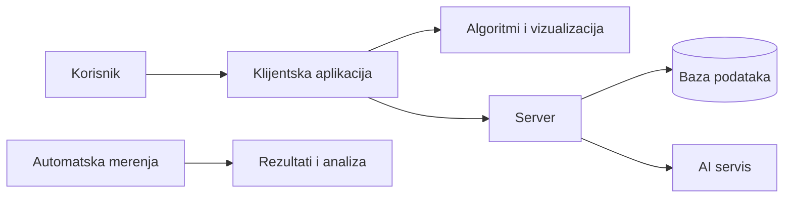
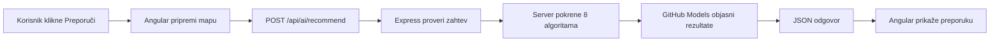

# Priprema za odbranu master rada

## Kako da koristiš ovaj dokument

Ovo nije skripta za ispit i ne treba je učiti napamet.

Cilj je da razumeš priču rada toliko dobro da možeš da je objasniš svojim rečima: profesoru, kolegi, ali i članu porodice koji se ne bavi programiranjem.

Dok čitaš, stalno sebi postavljaj tri pitanja:

1. **Šta je bio problem?**
2. **Kako sam ga rešio?**
3. **Šta sam iz toga naučio?**

Brojevi služe samo da potvrde zaključak. Ne treba da budu glavna priča.

---

# 1. Suština rada

## Šta sam napravio?

Napravio sam veb-aplikaciju koja pomaže da se razume kako različiti algoritmi traže put kroz mapu.

Korisnik na ekranu vidi mrežu polja, početak, cilj, prepreke i teren različite težine. Može da izabere algoritam i posmatra, korak po korak, kako on istražuje mapu i dolazi do rešenja.

Aplikacija ne pokazuje samo konačan put. Ona pokazuje i **kako je algoritam razmišljao**:

- koja polja je razmotrio;
- kojim redom ih je obilazio;
- koliko je posla uradio;
- da li je pronašao najbolji put;
- kako se njegovo ponašanje razlikuje od drugih algoritama.

## Zašto je to korisno?

Kada algoritam gledamo samo kao nekoliko redova pseudokoda, teško je steći osećaj za njegovo ponašanje.

Na istoj mapi jedan algoritam može da istraži skoro sve oko sebe, drugi može odmah da krene ka cilju, a treći može brzo da pronađe put koji ipak nije najbolji. Kada se to vidi i izmeri, razlike postaju mnogo jasnije.

## Kako bih rad objasnio za jedan minut?

> Napravio sam aplikaciju za vizualizaciju i poređenje algoritama za pronalaženje puta. Korisnik može da nacrta mapu, postavi prepreke i različite cene terena, a zatim da vidi kako osam algoritama traži put. Aplikacija ima i režim za direktno poređenje i režim u kome korisnik sam pokušava da pronađe put. Važan deo rada je što nisam ostao samo na animaciji: napravio sam sistem koji iste algoritme pokreće na velikom broju istih mapa i meri koliko su istraživali i kakav su put pronašli. Dodao sam i AI pomoć, ali tako da program računa rezultate, a AI ih samo objašnjava. Glavni zaključak je da ne postoji jedan najbolji algoritam za svaku situaciju: izbor zavisi od toga da li nam je važniji sigurno najbolji put ili brže dolaženje do dovoljno dobrog puta.

## Šta je stvarni doprinos rada?

Rad povezuje tri stvari koje se često posmatraju odvojeno:

1. **vizualizaciju** — da se rad algoritma vidi;
2. **poređenje i merenje** — da se utisak proveri brojevima;
3. **aktivno učenje** — da korisnik sam rešava problem i dobija povratnu informaciju.

AI je dodat kao pomoć za objašnjenje, a ne kao zamena za algoritme.

---

# 2. Problem koji algoritmi rešavaju

## Mapa kao graf

U teoriji se problem predstavlja grafom. To zvuči apstraktno, ali je ideja jednostavna:

- svako prohodno polje na mapi je jedna tačka;
- prelazak u susedno polje je veza između dve tačke;
- zid znači da veza ne postoji;
- start je mesto sa kog krećemo;
- cilj je mesto do kog želimo da stignemo.

Algoritam, dakle, pokušava da pronađe niz dozvoljenih prelazaka od starta do cilja.

## Najkraći put nije uvek i najjeftiniji

Zamisli da postoje dva puta:

| Put | Broj koraka | Cena svakog koraka | Ukupna cena |
|---|---:|---|---:|
| A | 3 | 1, 5, 1 | 7 |
| B | 4 | 1, 1, 1, 1 | 4 |

Put A je kraći jer ima tri koraka. Put B je jeftiniji jer mu je ukupna cena četiri.

To je važna razlika u celom radu:

- **najkraći put** ima najmanje koraka;
- **najjeftiniji, odnosno optimalan put** ima najmanju ukupnu cenu.

Ako sva polja koštaju isto, ta dva pojma se uglavnom poklapaju. Kada postoje težine terena, više ne moraju da se poklope.

## Šta je heuristika?

Heuristika je razumna procena koliko smo još daleko od cilja.

Zamisli da tražiš izlaz u gradu. Možeš sistematski da proveravaš svaku ulicu, ali je prirodno da prednost daš ulicama koje vode približno ka odredištu. Procena pravca i udaljenosti do odredišta je heuristika.

Ona ne govori koliko će put sigurno koštati. Ona samo pomaže algoritmu da odluči **gde prvo da traži**.

Dobra heuristika smanjuje nepotrebno istraživanje. Loša ili previše agresivna procena može da navede algoritam da previdi bolji obilazak.

---

# 3. Kako algoritmi „razmišljaju”

Ne treba učiti definicije napamet. Dovoljno je razumeti koju informaciju svaki algoritam koristi kada bira sledeće polje.

## BFS — širenje u talasima

BFS kreće od početka i širi se ravnomerno, kao talasi kada kamen padne u vodu.

Prvo proverava sva polja udaljena jedan korak, zatim sva udaljena dva koraka, pa tri i tako dalje. Zbog toga sigurno pronalazi put sa najmanje koraka kada svi koraci koštaju isto.

Ali BFS ne razmišlja o ceni terena. U prethodnom primeru izabrao bi put A sa tri koraka, iako košta 7, umesto puta B koji ima četiri koraka, ali košta 4.

**Suština:** odličan za mape na kojima svaki korak ima istu cenu; nije dovoljan kada teren ima različite cene.

## DFS — jedan pravac do kraja

DFS izabere jedan pravac i prati ga što dublje može. Tek kada udari u ćorsokak, vraća se i pokušava drugi pravac.

To je kao rešavanje lavirinta tako što na prvom raskršću izabereš prolaz i ne odustaješ dok te zid ne natera da se vratiš.

Može slučajno brzo da pronađe cilj, ali može i dugo da luta. Ne garantuje ni najkraći ni najjeftiniji put.

**Suština:** koristan je da se pokaže razlika između „pronašao sam neki put” i „pronašao sam dobar put”.

## Dijkstra — sigurno najjeftiniji put

Dijkstra u svakom trenutku nastavlja putem koji je do tada najmanje koštao.

Ako jedan pravac trenutno košta 4, a drugi 7, prvo nastavlja onim od 4. Ne zanima ga da li taj pravac vizuelno ide ka cilju; zanima ga samo stvarna cena koju je do sada platio.

Zbog toga pouzdano nalazi najjeftiniji put, ali često istraži veliki deo mape jer nema osećaj u kom smeru se cilj nalazi.

**Suština:** pouzdan, ali oprezan. Zna cenu, ali ne zna pravac.

## A* — Dijkstra koji zna približan pravac

A* koristi dve informacije:

1. koliko je put do trenutnog mesta već koštao;
2. koliko smo, prema proceni, još daleko od cilja.

Zato možemo da ga posmatramo kao Dijkstru kome smo dali kompas.

On i dalje vodi računa o stvarnoj ceni puta, ali daje prednost poljima koja deluju obećavajuće. Uz odgovarajuću heuristiku može da pronađe isti najbolji put kao Dijkstra, a da istraži mnogo manje mape.

U našim merenjima upravo se to dogodilo: A* je nalazio put istog kvaliteta kao Dijkstra, ali je u proseku istraživao približno dve trećine manje polja.

**Suština:** kada je heuristika dobra, dobijamo pouzdanost Dijkstre uz mnogo bolje usmeravanje.

## Greedy — samo ka cilju

Greedy gleda gotovo samo procenu udaljenosti do cilja. Njegovo razmišljanje je: „Koje polje me trenutno najviše približava cilju?”

Zbog toga često radi veoma brzo. Problem je što ne obraća dovoljno pažnje na cenu puta koji je već prešao.

Može da krene direktno ka cilju, uđe u skup teren ili upadne iza prepreke, i na kraju dobije lošiji put od algoritma koji je na početku napravio mali obilazak.

**Suština:** brz i odlučan, ali kratkovid.

## Swarm i Convergent Swarm — različita mera poverenja u procenu

Swarm i Convergent Swarm su varijante A* algoritma. Razlika je u tome koliko veruju proceni pravca ka cilju.

- A* pravi ravnotežu između već pređene cene i procene do cilja.
- Swarm kaže: „Pravac ka cilju mi je malo važniji.”
- Convergent Swarm kaže: „Pravac ka cilju mi je mnogo važniji.”

Zato Swarm obično istražuje manje polja od A*, ali ponekad pronađe malo skuplji put. Convergent Swarm je još agresivniji: može dodatno da smanji istraživanje, ali je veća šansa da će propustiti dobar obilazak.

U rezultatima rada Swarm se pokazao kao razuman kompromis: radio je primetno manje od A*, dok su pronađeni putevi u proseku bili samo malo skuplji. Convergent Swarm je štedeo još malo rada, ali je kvalitet puta opadao mnogo više.

**Prirodan odgovor na pitanje „Šta su Swarm i Convergent Swarm?”**

> To su dve varijante A* algoritma koje više veruju proceni pravca ka cilju. Zbog toga manje istražuju mapu, ali više ne mogu uvek da garantuju najbolji put. Swarm pravi umeren kompromis, dok je Convergent Swarm agresivniji i zato češće žrtvuje kvalitet puta radi brzine.

Nazivi su preuzeti iz postojećeg vizualizatora. U stručnoj terminologiji pripadaju porodici ponderisanog A* algoritma.

## 0-1 BFS — specijalista za dve cene

0-1 BFS je namenjen posebnom slučaju u kome prelazak može da košta samo 0 ili 1.

Pošto postoje samo dve moguće cene, algoritam može veoma jednostavno da da prednost besplatnom prelazu i da radi brže od opštijih rešenja.

Ako mu damo cene 2, 5 ili 10, koristimo ga van problema za koji je napravljen. Tada ne treba očekivati najbolje rešenje.

**Suština:** veoma efikasan specijalista, ali samo unutar svog domena.

## Cela porodica u jednoj slici

| Algoritam | Najjednostavnije objašnjenje |
|---|---|
| BFS | širi se ravnomerno i traži najmanje koraka |
| DFS | prati jedan pravac do kraja, pa se vraća |
| Dijkstra | uvek nastavlja trenutno najjeftinijim putem |
| A* | prati cenu, ali koristi i procenu pravca ka cilju |
| Greedy | gotovo samo juri ka cilju |
| Swarm | A* koji malo više veruje proceni |
| Convergent Swarm | A* koji mnogo više veruje proceni |
| 0-1 BFS | brzo rešava poseban slučaj sa cenama 0 i 1 |

---

# 4. Pojmovi koje treba razumeti

## Algoritam

Algoritam je precizan postupak za rešavanje problema. Kao recept: definiše koje korake treba uraditi i kojim redom.

## Težina ili cena polja

Broj koji govori koliko je „skupo” preći preko nekog terena. Na primer, asfalt može da košta 1, blato 5, a zid je neprohodan.

## Optimalan put

Put sa najmanjom ukupnom cenom među svim mogućim putevima.

Optimalan ne znači nužno da ima najmanje koraka. Ako postoje različite težine, malo duži obilazak može biti jeftiniji.

## Obrađeno ili prošireno polje

Polje koje je algoritam uzeo na razmatranje i iz njega proverio moguće nastavke.

Ako dva algoritma pronađu isti put, a jedan obradi 200 polja, a drugi 600, prvi je do rešenja došao sa manje istraživanja.

## Frontijer

Skup polja koja je algoritam otkrio, ali ih još nije obradio. Možemo ga zamisliti kao listu sledećih kandidata za proveru.

Najveća veličina te liste daje predstavu o tome koliko memorije pretraga zahteva.

## Suboptimalnost

Suboptimalnost govori koliko je pronađeni put skuplji od najboljeg mogućeg puta.

Ako najbolji put košta 100, a algoritam pronađe put koji košta 110, njegov put je 10% skuplji. Kažemo da je suboptimalnost 10%.

- 0% znači da je pronađen najbolji put;
- mala vrednost znači da je put blizu najboljeg;
- velika vrednost znači da je algoritam napravio skup kompromis.

Ova mera nam omogućava da pošteno kažemo: „Algoritam je istražio manje, ali koliko smo kvaliteta puta time izgubili?”

## Složenost

Složenost opisuje kako raste količina posla kada problem postaje veći. Ne govori koliko je algoritam trajao na jednom računaru u milisekundama, već kako se ponaša kada povećavamo mapu.

Za odbranu je važnije razumeti tu ideju nego pamtiti matematičke oznake.

---

# 5. Šta korisnik može da radi u aplikaciji

## Vizualizacija

Korisnik bira jedan algoritam i posmatra njegov rad korak po korak. Može da pokrene, pauzira, ubrza, uspori ili premota prikaz.

Ovaj režim odgovara na pitanje: **„Kako ovaj algoritam dolazi do rešenja?”**

## Poređenje

Više algoritama se pokreće nad istom mapom. Tako se neposredno vidi ko je istraživao šire, ko je brže krenuo ka cilju i ko je pronašao bolji put.

Ovaj režim odgovara na pitanje: **„Zašto se algoritmi različito ponašaju na istom problemu?”**

## Playground

Korisnik sam pokušava da nacrta put od starta do cilja. Sistem zatim proverava da li je put dozvoljen, koliko košta i koliko je dobar u odnosu na referentno rešenje.

Ovaj režim pretvara korisnika iz posmatrača u učesnika.

## Ostale mogućnosti

Korisnik može da:

- nacrta zidove i teren različite cene;
- automatski generiše različite tipove mapa;
- sačuva i ponovo učita mapu;
- čuva rezultate i istoriju pokušaja;
- koristi aplikaciju na srpskom ili engleskom;
- dobije kontekstualno AI objašnjenje.

---

# 6. Kako je sistem sastavljen

Sistem ima nekoliko delova, od kojih svaki radi posao za koji je najpogodniji.



## Klijentska aplikacija — ono što korisnik vidi

Klijent radi u internet pregledaču. Prikazuje mapu, prima klikove korisnika, pokreće animaciju i prikazuje rezultate.

Napravljen je u Angular-u. Angular je razvojni okvir koji pomaže da se složen korisnički interfejs podeli na jasne stranice, komponente i servise.

Mreža se crta pomoću Canvas-a. Canvas je jedna površina za crtanje. Pogodan je zato što je mnogo lakše brzo nacrtati hiljade polja na jednoj površini nego napraviti hiljade zasebnih elemenata stranice.

## Server — posao iza ekrana

Server obrađuje stvari koje ne treba prepustiti pregledaču:

- prijavu korisnika;
- čuvanje i učitavanje mapa;
- istoriju rezultata;
- bodovanje i rang-listu;
- komunikaciju sa AI servisom;
- masovna automatska merenja.

Napravljen je pomoću Node.js-a i Express-a. Jednostavno rečeno, to su alati za pravljenje serverskog dela veb-aplikacije.

## Baza podataka — trajna memorija sistema

MongoDB čuva korisnike, mape, rezultate i pokušaje u Playground-u.

Bez baze bi sve nestalo kada korisnik zatvori stranicu ili ponovo pokrene aplikaciju.

## Python analiza — obrada rezultata

Python je programski jezik sa dobrim alatima za statistiku i crtanje grafikona.

U ovom radu nije korišćen za samu vizualizaciju. Korišćen je nakon eksperimenata: učita rezultate, izračuna proseke i druge pokazatelje i od njih napravi tabele i grafikone za rad.

## Zašto algoritmi postoje i na klijentu i na serveru?

Na klijentu algoritam mora detaljno da beleži svaki korak kako bi animacija mogla da se prikaže.

Na serveru nam animacija nije potrebna. Tamo želimo da brzo pokrenemo mnogo testova ili da proverimo rešenje za Playground.

To su, dakle, iste ideje prilagođene različitim poslovima: jedna verzija je namenjena objašnjavanju, druga brzom računanju.

---

# 7. Najvažnije implementacione odluke

## Algoritam ne crta direktno na ekranu

Svi algoritmi prijavljuju događaje istim jezikom, na primer:

- „ovo polje je otkriveno”;
- „ovo polje se sada obrađuje”;
- „pronađen je put”;
- „put ne postoji”.

Poseban deo aplikacije te događaje pretvara u boje i animaciju.

Ovo razdvajanje je važno jer prikaz ne mora da zna unutrašnje detalje svakog algoritma. Ako se doda novi algoritam koji šalje iste vrste događaja, ostatak vizualizacije može da ostane isti.

## Izvršavanje i prikaz nisu ista stvar

Algoritam prvo napravi niz koraka, a aplikacija zatim taj niz reprodukuje željenom brzinom.

Zahvaljujući tome korisnik može da pauzira, premota ili skoči na određeni trenutak bez ponovnog računanja svega od početka.

## Poređenje mora da bude pošteno

Svi algoritmi dobijaju potpuno istu mapu. Ne bi imalo smisla porediti A* na jednostavnoj mapi i Dijkstru na teškoj mapi.

Program zato može da napravi mapu iz poznatog početnog broja, odnosno seed-a. Kada se upotrebi isti seed, dobija se ista mapa. Tako eksperiment može ponovo da se pokrene pod istim uslovima.

Cena svakog pronađenog puta ponovo se računa istim pravilom, nezavisno od toga koji ga je algoritam pronašao. Time svi algoritmi dobijaju isti „metar” za poređenje.

---

# 8. Kako je rad proveren

## Šta smo merili?

Za svako pokretanje posmatrane su četiri osnovne stvari:

1. **Da li je put pronađen?**
2. **Koliko taj put košta?**
3. **Koliko je polja algoritam morao da obradi?**
4. **Koliko kandidata je morao istovremeno da pamti?**

Merilo se i vreme, ali ono zavisi od računara i trenutnog opterećenja. Broj obrađenih polja je stabilniji pokazatelj količine rada algoritma.

## Kako smo obezbedili smisleno poređenje?

- algoritmi su dobijali iste mape;
- mape su mogle ponovo da se naprave iz istog seed-a;
- svi putevi su ocenjivani istim pravilom;
- testirano je više tipova i veličina mapa;
- čuvani su sirovi rezultati, a tabele su automatski pravljene iz njih.

Ukupno je izvršeno 9.444 pokretanja algoritama. Taj broj nije poenta sam za sebe. Važan je zato što zaključak ne potiče iz jedne pažljivo izabrane mape, već iz mnogo različitih situacija.

## Šta smo zaključili?

### A* koristi dobru informaciju da izbegne nepotreban rad

A* je pronalazio put istog kvaliteta kao Dijkstra, ali je istraživao znatno manje mape. To potvrđuje smisao heuristike: dobra procena ne menja cilj, već pomaže da do njega stignemo usmerenije.

### Brzina i kvalitet često su kompromis

Greedy i agresivnije A* varijante obično istražuju manje. Cena toga je što ponekad pronađu skuplji put.

Swarm je u našim testovima bio dobar srednji izbor: znatno je smanjio istraživanje, a putevi su ostali blizu najboljih. Convergent Swarm je pokazao da preveliko oslanjanje na procenu donosi sve manju uštedu, a sve veći gubitak kvaliteta.

### Pretpostavke algoritma su važne

BFS je odličan kada svaki korak košta isto, ali ne razume različite cene terena.

0-1 BFS je odličan kada postoje samo cene 0 i 1, ali nije namenjen opštim težinama.

Algoritam nije „dobar” ili „loš” sam po sebi. Dobar je kada odgovara problemu koji rešavamo.

### Ne postoji jedan pobednik

Ako je najbolji put obavezan, prirodan izbor su Dijkstra ili A*.

Ako je mala greška prihvatljiva radi manjeg istraživanja, Swarm može biti dobar kompromis.

Ako svaki korak košta isto, BFS je jednostavan i pouzdan.

Ako su cene samo 0 i 1, 0-1 BFS je specijalizovano rešenje.

Najvažniji zaključak nije „algoritam X je pobedio”, već **„izbor zavisi od osobina problema i od toga šta nam je važno”**.

---

# 9. Uloga veštačke inteligencije

## Osnovno pravilo

Najvažnija odluka u AI delu rada može da se sažme jednom rečenicom:

> Program računa, a AI objašnjava.

Klasični algoritmi računaju put, cenu i broj obrađenih polja. AI dobija te već proverene informacije i pretvara ih u razumljivo objašnjenje.

Tako je smanjen rizik da model izmisli broj ili proglasi pogrešan put najboljim.

## Četiri AI mogućnosti

### Tutor

Program izabere važne trenutke izvršavanja, a AI objašnjava šta se u njima dogodilo i zašto su bitni.

### Generator

Korisnik opiše kakvu mapu želi. AI taj opis pretvara u jasne uslove, a program zatim pravi više mapa i proverava koja zaista ispunjava zahtev.

AI, dakle, ne dobija pravo da proizvoljno proglasi mapu dobrom. Konačnu proveru obavljaju algoritmi.

### Preporuka algoritma

Sistem već ima izmerene rezultate na konkretnoj mapi. AI ih koristi da korisniku objasni koji algoritam ima smisla i zašto.

### Kontekstualna pomoć

Korisnik može da zatraži objašnjenje pojma ili rezultata koji trenutno gleda.

## Zašto AI nije glavni deo računanja?

Jezički model je dobar u objašnjavanju, ali nije pouzdan kalkulator. Može lepo da formuliše odgovor i da ipak pogreši broj.

Zato mu je u ovom sistemu data uloga za koju je koristan, dok proverljive činjenice ostaju odgovornost običnog programa.

## Šta je evaluacija AI dela pokazala?

Modeli su uglavnom uspešno vraćali odgovor u traženom obliku, ali nisu uvek pravilno zaključivali koji je algoritam najbolji ili najgori.

To nije neuspeh cele ideje. Naprotiv, to potvrđuje da je ispravno što AI nije postavljen kao konačni autoritet.

Generator je uglavnom dobro razumevao šta korisnik traži, ali program nije uvek uspevao da među napravljenim kandidatima pronađe mapu sa baš tim svojstvom. To pokazuje razliku između razumevanja zahteva i uspešnog pronalaženja rešenja.

---

# 10. Playground i aktivno učenje

U Playground režimu korisnik ne gleda tuđe rešenje, već sam gradi put.

Sistem zatim razmatra:

- da li put zaista ide od starta do cilja;
- da li prolazi kroz zid ili preskače polja;
- koliko košta;
- koliko je blizu najboljem poznatom putu;
- koliko brzo je korisnik završio.

Na osnovu toga daje skor i objašnjava gde su poeni dobijeni ili izgubljeni.

Smisao skora nije takmičenje samo po sebi. Njegova svrha je da korisnik vidi posledicu svoje odluke. Možda je stigao do cilja, ali je izabrao skup teren. Možda je put ispravan, ali postoji mnogo bolji obilazak.

Automatskim simulacijama provereno je da bodovanje razlikuje dobra, slaba i neispravna rešenja. Ipak, stvarni osećaj korisnika može da se proveri samo radom sa pravim ljudima, što ostaje sledeći korak.

---

# 11. Ograničenja i dalji razvoj

Dobar odgovor na pitanje o ograničenju nije odbrana po svaku cenu. Dovoljno je jasno reći šta rezultat pokazuje, a šta još ne pokazuje.

## Najvažnija ograničenja

- Mape su automatski generisane. Pokrivaju različite situacije, ali ne predstavljaju svaki mogući realan problem.
- Vreme je mereno na jednom računaru, pa su odnosi korisniji od samih vrednosti u milisekundama.
- AI modeli nisu podjednako pouzdani i zavise od dostupnog servisa.
- Interfejs je analiziran prema poznatim pravilima dizajna, ali nije sprovedena puna studija sa stvarnim studentima.
- Algoritmi nisu samo na serveru: verzije za animaciju izvršavaju se u pregledaču, a posebne brze verzije koriste se na serveru za merenja i provere. Pošto su ista pravila implementirana na više mesta, mogu se vremenom razići, pa bi zajedničko jezgro bilo dobro unapređenje.

## Šta bih sledeće uradio?

Prvi sledeći korak bila bi korisnička studija: dati studentima konkretne zadatke, posmatrati gde greše i izmeriti da li im aplikacija zaista pomaže da bolje razumeju algoritme.

Tehnički bih zatim:

- spojio zajednička pravila klijentskih i serverskih algoritama;
- potpuno prebacio proveru Playground skora na server;
- dodao algoritme koji efikasno menjaju put dok se mapa menja;
- proširio skup standardnih mapa za poređenje sa drugim radovima.

## Ako neko pita za nešto iz početne ideje što nije realizovano

> To je bila početna zamisao, ali bi njena implementacija znatno povećala složenost, a nije bila neophodna da pokažemo glavnu ideju rada. Fokusirali smo se na funkcije koje možemo kvalitetno da realizujemo i proverimo, dok su složenija proširenja ostavljena kao pravac za dalji rad.

Nema potrebe da ovu temu sam otvaraš u prezentaciji.

---

# 12. Prirodna pitanja i odgovori

Odgovori ispod nisu tekst za recitovanje. Oni pokazuju ideju koju treba izraziti svojim rečima.

## Šta je tema rada?

Napravio sam aplikaciju koja prikazuje kako algoritmi traže put kroz mapu, omogućava da ih uporedimo pod istim uslovima i pomaže korisniku da kroz sopstveni pokušaj razume njihove razlike.

## Zašto je vizualizacija potrebna?

Zato što konačan put ne pokazuje kako je algoritam do njega došao. Dva algoritma mogu da vrate isti put, ali da jedan pretraži skoro celu mapu, a drugi samo uzak prostor prema cilju.

## Šta je graf?

Graf je skup tačaka i veza između njih. U ovoj aplikaciji polja su tačke, a dozvoljeni prelazi između susednih polja su veze.

## Koja je razlika između najkraćeg i najboljeg puta?

Najkraći ima najmanje koraka. Najbolji ima najmanju ukupnu cenu. Ako različita polja imaju različite cene, duži put može biti jeftiniji.

## Šta je heuristika?

Heuristika je procena koliko smo još daleko od cilja. Ona je kao kompas: ne daje ceo put, ali pomaže algoritmu da prvo istraži obećavajući pravac.

## Zašto je A* efikasniji od Dijkstre?

Dijkstra zna samo koliko je put do sada koštao. A* tome dodaje procenu pravca do cilja. Zato manje vremena troši istražujući oblasti koje vode na pogrešnu stranu, a uz dobru procenu i dalje pronalazi najbolji put.

## Zašto BFS ne nalazi uvek najbolji put?

BFS broji korake, ali ne razume da jedno polje može da bude skuplje od drugog. Zato može da izabere tri skupa koraka umesto četiri jeftina.

## Šta su Swarm i Convergent Swarm?

To su varijante A* algoritma koje više veruju proceni pravca ka cilju. Zbog toga obično istražuju manje, ali mogu da propuste najbolji obilazak. Swarm pravi umeren kompromis, dok je Convergent Swarm agresivniji.

## Šta znači suboptimalnost?

Govori koliko je pronađeni put skuplji od najboljeg. Ako najbolji košta 100, a pronađeni 110, suboptimalnost je 10%.

## Koji algoritam je najbolji?

Ne postoji jedan najbolji za sve. A* je odličan kada želimo najbolji put i imamo dobru procenu. Swarm ima smisla kada prihvatamo malo lošiji put radi manjeg istraživanja. BFS je dovoljan kada svi koraci koštaju isto, a 0-1 BFS kada postoje samo dve posebne cene.

## Zašto je aplikacija full-stack?

Full-stack znači da aplikacija obuhvata i deo koji korisnik vidi i serverski deo iza njega. Vizualizacija može da radi u pregledaču, ali nalozi, čuvanje mapa, istorija, bodovanje, rang-lista i bezbedna komunikacija sa AI servisom zahtevaju server i bazu podataka.

## Zašto Canvas?

Mapa može da ima hiljade polja koja često menjaju boju. Canvas omogućava da ih efikasno crtamo na jednoj površini umesto da svako polje bude poseban element stranice.

## Kako je obezbeđeno pošteno poređenje?

Svi algoritmi rade na istoj mapi, a cena njihovih puteva računa se istim pravilom. Mape se mogu ponoviti iz istog seed-a, pa eksperiment može ponovo da se izvede.

## Zašto nije dovoljno samo meriti vreme?

Vreme zavisi od računara i trenutnog opterećenja. Broj obrađenih polja neposrednije pokazuje koliko je algoritam istraživao. Vreme je korisna dopuna, ali nije jedina mera.

## Zašto je uvedena veštačka inteligencija?

Program veoma dobro računa tačne rezultate, ali ne ume uvek da ih objasni početniku. AI može da pretvori proverene podatke u razumljivo objašnjenje. Zato program ostaje izvor činjenica, a AI pomaže u tumačenju.

## Kako sprečavate da AI izmisli rezultat?

AI ne računa osnovne rezultate. Program mu šalje već izmerene podatke, odgovor mora da bude u očekivanom obliku i proverava se pre prikaza. Rizik nije potpuno uklonjen, ali je značajno ograničen.

## Šta je bilo najvažnije u načinu implementacije?

Odvajanje algoritma od prikaza. Algoritam samo prijavljuje šta se dogodilo, a poseban deo aplikacije to crta. Zbog toga svih osam algoritama može da koristi isti sistem za animaciju i kontrole.

## Kako znate da rezultati nisu slučaj jedne mape?

Algoritmi su pokrenuti hiljadama puta na različitim tipovima i veličinama mapa. Isti uslovi korišćeni su za sve algoritme, pa smo posmatrali obrazac ponašanja, a ne jedan lep primer.

## Šta je glavni zaključak rada?

Dobra dodatna informacija, kao što je heuristika, može drastično da smanji nepotrebno istraživanje. Ali što joj algoritam više veruje, veći je rizik da će žrtvovati kvalitet puta. Zato izbor algoritma zavisi od problema i prioriteta.

## Šta je najveće ograničenje rada?

Tehnička evaluacija je obimna, ali nije sprovedena studija sa stvarnim studentima. Zato možemo da pokažemo da sistem radi i da algoritmi daju očekivane rezultate, ali još ne možemo da tvrdimo koliko aplikacija poboljšava učenje.

## Šta biste dodali u nastavku?

Prvo bih sproveo korisničku studiju. Zatim bih ujedinio algoritamska pravila između klijenta i servera i dodao dinamičko ponovno planiranje kada se mapa menja tokom kretanja.

---

# 13. Jednostavan tok prezentacije

Prezentacija treba da ispriča jednu priču, a ne da prepriča sva poglavlja rada.

## 1. Problem

Algoritmi mogu da pronađu isti cilj na veoma različite načine, a samo gledanje koda ne daje dobru intuiciju o tim razlikama.

## 2. Rešenje

Prikaži aplikaciju i tri režima: vizualizaciju, poređenje i Playground.

## 3. Kako algoritmi biraju

Na jednoj slici objasni:

- Dijkstra gleda dosadašnju cenu;
- A* dodaje procenu do cilja;
- Greedy uglavnom prati samo procenu;
- Swarm varijante menjaju koliko toj proceni veruju.

## 4. Kako je sistem napravljen

Objasni četiri dela: klijent prikazuje, server obrađuje, baza pamti, Python analizira rezultate.

## 5. Kako je provereno

Reci da su svi algoritmi pokretani na istim, ponovljivim mapama i da su mereni kvalitet puta i količina istraživanja.

## 6. Glavni rezultati

Zadrži tri poruke:

1. A* nalazi isti kvalitet kao Dijkstra uz mnogo manje istraživanja.
2. Swarm pokazuje da malo odricanje od kvaliteta može doneti dodatnu uštedu.
3. Algoritam mora da se koristi u problemu za koji je namenjen.

## 7. AI

Objasni pravilo: program računa, AI objašnjava.

## 8. Zaključak

Ne postoji univerzalni pobednik. Vrednost sistema je u tome što korisnik tu razliku može da vidi, proveri i sam iskusi.

---

# 14. Završna mentalna mapa

Ako pred odbranu imaš pet minuta, podseti se samo ovoga:

## Problem

Kod ne pokazuje intuitivno kako algoritam pretražuje mapu.

## Rešenje

Vizualizacija + poređenje + samostalno rešavanje + merljivi rezultati.

## Ključna ideja algoritama

- BFS broji korake.
- Dijkstra prati stvarnu cenu.
- A* dodaje procenu do cilja.
- Greedy uglavnom veruje samo proceni.
- Swarm varijante biraju koliko snažno da joj veruju.
- 0-1 BFS rešava poseban slučaj dve cene.

## Ključna ideja arhitekture

Klijent prikazuje, server obrađuje, baza pamti, Python analizira, AI objašnjava.

## Ključna ideja evaluacije

Ista mapa, ista pravila, mnogo ponavljanja — pa tek onda zaključak.

## Glavni zaključak

> Najbolji algoritam ne postoji van konteksta. Moramo znati kakav problem rešavamo i da li nam je važniji garantovano najbolji put ili manje istraživanja.

---

# 15. Tehnologije i biblioteke

Ovo poglavlje je tehnički dodatak. Nije potrebno nabrajati svaku biblioteku tokom prezentacije, ali treba znati **zašto je izabrana** i **koji posao obavlja**.

## Najpre: tehnologija, biblioteka, razvojni okvir i protokol

- **Tehnologija** je širok pojam, na primer TypeScript, MongoDB ili HTML5 Canvas.
- **Biblioteka** je gotov skup funkcija koje naš kod poziva, na primer RxJS ili bcryptjs.
- **Razvojni okvir** određuje strukturu većeg dela aplikacije. Angular i Express imaju tu ulogu.
- **API** je dogovoreni način na koji dva dela sistema razmenjuju podatke.
- **REST** je stil organizovanja HTTP API-ja, a ne posebna biblioteka.

## Klijentski deo

| Tehnologija | Šta je | Kako je korišćena |
|---|---|---|
| **Angular 21.2** | razvojni okvir za veb-interfejs | stranice, komponente, rutiranje, forme, servisi i ubrizgavanje zavisnosti |
| **TypeScript 5.9** | JavaScript sa statičkim tipovima | tipovi za mapu, algoritme, događaje i rezultate; ranije otkrivanje grešaka |
| **RxJS 7.8** | biblioteka za asinhrone tokove podataka | HTTP odgovori kao `Observable`, a stanje vizualizacije, teme i jezika kroz `BehaviorSubject` |
| **HTML5 Canvas 2D** | ugrađena površina pregledača za crtanje | brzo iscrtavanje cele mreže, posećenih polja, frontijera i puta |
| **Tailwind CSS 4.2** | sistem pomoćnih CSS klasa | raspored, prilagodljiv prikaz i deo stilizovanja interfejsa |
| **PostCSS** | alat koji obrađuje CSS pre isporuke pregledaču | deo lanca kojim se Tailwind stilovi pretvaraju u konačan CSS |
| **socket.io-client 4.8** | klijentska biblioteka za stalnu vezu sa serverom | prima obaveštenje da se rang-lista promenila |

Canvas nije dodatna JavaScript biblioteka. To je mogućnost samog pregledača. Izabran je zato što je efikasnije nacrtati veliki broj polja na jednoj površini nego održavati poseban HTML element za svako polje.

## Serverski deo

| Tehnologija ili biblioteka | Uloga u sistemu |
|---|---|
| **Node.js** | izvršava TypeScript/JavaScript serverski kod van pregledača |
| **Express 5.2** | definiše REST putanje za naloge, mape, rezultate, Playground, AI, merenja i slike |
| **MongoDB** | trajno čuva dokumente sistema |
| **Mongoose 9.4** | opisuje modele MongoDB dokumenata i olakšava upite i veze među njima |
| **Zod 4.3** | proverava oblik i granice podataka koji stignu u zahtevima |
| **jsonwebtoken** | potpisuje i proverava JWT tokene za prijavljenog korisnika |
| **bcryptjs** | čuva lozinke kao bezbedne sažetke, a ne kao običan tekst |
| **Helmet** | postavlja bezbednosna HTTP zaglavlja |
| **express-rate-limit** | ograničava učestale pokušaje prijave i preveliki broj AI poziva |
| **CORS** | određuje sa koje adrese pregledača server prihvata zahteve |
| **Socket.IO 4.8** | šalje događaj `leaderboard:update` svim povezanim klijentima |
| **Multer** | prima poslatu sliku profila kao `multipart/form-data` zahtev |
| **Cloudinary** | skladišti i prilagođava slike profila, a server čuva dobijenu adresu slike |
| **dotenv** | učitava podešavanja i tajne, kao što su adresa baze i AI token, iz okruženja |

MongoDB je baza podataka, dok je Mongoose biblioteka preko koje serverski kod razgovara sa tom bazom. JWT je potpisana potvrda identiteta, dok bcrypt služi za jednosmernu zaštitu lozinke. Te pojmove ne treba mešati.

## Veštačka inteligencija i obrada rezultata

| Tehnologija | Uloga |
|---|---|
| **GitHub Models** | spoljni servis preko kog se pozivaju jezički modeli |
| **OpenAI-kompatibilan format** | standardni JSON oblik zahteva za razgovor koji GitHub Models prihvata |
| **Python** | zasebna obrada izvezenih rezultata eksperimenata |
| **pandas** | učitavanje CSV podataka, grupisanje i pravljenje tabela |
| **NumPy** | numeričke operacije nad nizovima rezultata |
| **SciPy** | statistički proračuni, uključujući intervale poverenja i testove |
| **Matplotlib** | generisanje grafikona za master rad |

## Razvojni alati

Angular CLI i Angular Build služe za pokretanje i pakovanje klijenta. `ts-node` izvršava serverske TypeScript skripte bez prethodnog ručnog prevođenja, a `nodemon` ponovo pokreće server kada se kod promeni. Vitest i jsdom obezbeđuju okruženje za klijentske testove, Prettier ujednačava format koda, a `concurrently` istovremeno pokreće Angular i proces za obradu stilova.

## REST i Socket.IO nisu ista stvar

Zamisli dve vrste komunikacije:

- **REST je telefonski poziv sa konkretnim pitanjem.** Klijent pošalje zahtev, server vrati odgovor i taj razgovor je završen.
- **Socket.IO je otvorena linija.** Veza ostaje aktivna i server može sam da pošalje kratko obaveštenje kada se nešto promeni.

Većina sistema koristi REST. Na primer, `GET /api/maps` vraća mape, a `POST /api/ai/recommend` prima mapu i vraća preporuku. Socket.IO ima mnogo užu ulogu: kada neko preda Playground pokušaj, server emituje `leaderboard:update`; profil tada preko REST-a ponovo učita celu rang-listu i statistiku.

> REST prenosi glavninu podataka na zahtev. Socket.IO ovde samo javlja da se stanje promenilo.

---

# 16. Gde se algoritmi zaista izvršavaju?

## Kratak odgovor

Ne, frontend nije samo prikaz serverskog rezultata. U postojećoj implementaciji algoritmi postoje i izvršavaju se **i na klijentu i na serveru**, ali sa različitim namenama.

| Mesto | Šta se izvršava | Zašto |
|---|---|---|
| **Klijent, u pregledaču** | pune verzije koje proizvode događaje i trag | vizualizacija, kontrole reprodukcije i direktno poređenje |
| **Server, laki izvršavač** | verzije bez vizuelnog traga | AI preporuka, provera kandidat-mapa i putanja `/playground/solve` |
| **Server, benchmark izvršavač** | merne verzije sa svim metrikama | hiljade ponovljivih eksperimenata bez troška animacije |

Kada korisnik klikne „Pokreni” u vizualizaciji, Angular ne čeka da server izračuna svaki korak. `VisualizationService` u pregledaču napravi algoritam, izvrši ga do kraja, sačuva grupe događaja i zatim ih reprodukuje željenom brzinom na Canvas-u.

Server ima svoje brze realizacije zato što mu za automatsko poređenje nije potrebna boja svakog polja ni mogućnost pauziranja. Potrebni su mu samo put i merene vrednosti. Izostavljanje hiljada događaja čini masovna merenja znatno bržim.

## Zašto je onda dupliranje rizik?

Zajednički su ideja algoritma i format podataka, ali izvršni kod nije jedna ista funkcija koju obe strane pozivaju. Ako se pravilo popravi na jednom mestu, a zaboravi na drugom, rezultati mogu da se raziđu.

Konkretan primer već postoji u režimu sa osam suseda:

- klijentska verzija zabranjuje dijagonalni prolaz kroz ugao koji zatvaraju dva zida;
- benchmark verzija proverava samo da ciljno dijagonalno polje nije zid i takav prolaz dopušta.

To ne utiče na glavna merenja sa četiri suseda, ali znači da rezultate posebnog eksperimenta sa dijagonalama treba tumačiti kao ponašanje benchmark modela, a ne kao potpuno identično ponašanje interaktivnog prikaza.

Zajedničko algoritamsko jezgro bi uklonilo tu vrstu razlike. Klijent bi istom jezgru dodao beleženje događaja, dok bi ga server pokretao bez beleženja.

## Odgovor za odbranu

> Algoritmi nisu implementirani samo na bekendu. Interaktivna vizualizacija ih izvršava u pregledaču i od svakog koraka pravi događaje za animaciju. Server sadrži posebne, lakše verzije za benchmark, AI proveru i serversko rešavanje, jer tamo trag nije potreban. Prednost je brzina i nezavisna vizualizacija, a mana je mogućnost da se dva skupa pravila raziđu, pa bi zajedničko jezgro bilo dobro naredno unapređenje.

---

# 17. Najvažniji implementacioni detalji

## Zajednički interfejs algoritama

Interfejs je ugovor: govori koje operacije svaki algoritam mora da ponudi, bez obzira na to kako ih interno izvodi.

U aplikaciji taj ugovor izgleda ovako:

```typescript
interface PathfindingAlgorithm {
    init(grid, start, goal, options): void;
    step(): AlgorithmEvent[];
    isDone(): boolean;
    getResult(): AlgorithmResult;
    getTrace(): AlgorithmEvent[];
}
```

- `init` postavlja mapu, početak, cilj i opcije.
- `step` izvršava jedan logički korak i vraća događaje koji su nastali.
- `isDone` govori da li je pretraga završena.
- `getResult` vraća put, cenu i zbirne metrike.
- `getTrace` vraća ceo redosled događaja za reprodukciju.

Ovo je **step-based state machine**, odnosno algoritam predstavljen kao mašina stanja koja napreduje korak po korak. Zbog toga spoljašnji kod odlučuje kada će se sledeći korak dogoditi.

## Kako A* primenjuje taj ugovor?

A* nema zasebnu veliku klasu. Dijkstra, A*, Greedy, Swarm i Convergent Swarm koriste istu klasu `BestFirstEngine`, koja implementira navedeni interfejs. Fabrika napravi tu klasu i prosledi joj izabrani tip algoritma.

Njihova glavna razlika svedena je na računanje prioriteta:

```typescript
case DIJKSTRA:         return g;
case A_STAR:           return g + h;
case GREEDY:           return h;
case SWARM:            return g + 2 * h;
case CONVERGENT_SWARM: return g + 5 * h;
```

Ovde je `g` stvarna cena od početka do trenutnog polja, a `h` procena preostalog puta. Tako jedna promenljiva odluka proizvodi pet različitih ponašanja, dok kod za susede, prioritetni red, ažuriranje cene i rekonstrukciju puta ostaje isti.

BFS, DFS i 0-1 BFS imaju zasebne klase jer koriste drugačije strukture podataka: red, stek i dvostrani red.

## Kako izgleda jedan događaj?

Kada algoritam otkrije novo polje, može da proizvede ovakav objekat:

```json
{
    "type": "OPEN_ADD",
    "node": { "row": 4, "col": 7 },
    "g": 6,
    "h": 8,
    "f": 14,
    "parent": { "row": 4, "col": 6 }
}
```

To znači: polje `(4, 7)` je dodato među kandidate; dosadašnja cena je 6, procena do cilja 8, prioritet 14, a do njega smo došli iz polja `(4, 6)`.

Algoritam ne kaže „oboji polje plavo”. On samo prijavljuje činjenicu `OPEN_ADD`. `GridRendererService` odlučuje kako se ta činjenica crta. Zbog toga matematička logika nije vezana za izgled interfejsa.

## Kako frontend koristi događaje?

Suština klijentskog toka može se svesti na sledeće:

```typescript
const algorithm = createAlgorithm(grid, start, goal, options);

while (!algorithm.isDone()) {
    allStepEvents.push(algorithm.step());
}

renderer.applyEvents(allStepEvents[currentStep]);
```

Prvo se ceo trag izračuna i sačuva. Zatim tajmer pomera `currentStep`, a renderer kroz `switch` reaguje na tip događaja:

- `OPEN_ADD` dodaje polje u frontijer;
- `CLOSE_ADD` prebacuje ga među obrađena polja;
- `SET_CURRENT` označava trenutno polje;
- `FOUND_PATH` oboji konačan put;
- `NO_PATH` završava prikaz bez puta.

Premotavanje ne pokreće algoritam ponovo. Renderer obriše vizuelno stanje i brzo ponovo primeni događaje do izabranog koraka.

## Kako izgleda rezultat?

Svi algoritmi vraćaju isti osnovni oblik:

```typescript
interface AlgorithmResult {
    path: Position[] | null;
    cost: number;
    expandedCount: number;
    maxFrontierSize: number;
    totalSteps: number;
}
```

Ovaj zajednički oblik omogućava da isti panel metrika i isti režim poređenja rade za svih osam algoritama.

## Gde je granica tipizacije?

Tipovi algoritama i događaja su centralizovani u `shared/types`. Međutim, deo metoda u `ApiService` za HTTP odgovore koristi tip `any`, dok server zahteve proverava Zod šemama. Sistem zato ima jasan stvarni JSON ugovor, ali taj ugovor nije potpuno povezan statičkim tipovima od servera do Angular-a.

Dobro unapređenje bilo bi da klijent i server dele iste DTO tipove i šeme. DTO je mali objekat namenjen prenosu podataka između delova sistema.

---

# 18. Put jednog zahteva kroz ceo sistem

## Primer: korisnik traži AI preporuku algoritma

Ovaj primer je koristan jer pokazuje Angular, REST, Express, validaciju, serverske algoritme, spoljni AI servis i povratak rezultata na ekran.



## 1. Frontend pripremi zahtev

`AIService` ne šalje celu unutrašnju strukturu svake ćelije. Od mape pravi sažet mrežni format:

```json
{
    "gridData": {
        "rows": 25,
        "cols": 50,
        "walls": [[3, 4], [3, 5]],
        "weights": [{ "pos": [8, 10], "weight": 5 }],
        "start": [12, 5],
        "goal": [12, 40]
    },
    "mapSummary": {
        "wallCount": 2,
        "weightedCount": 1
    },
    "language": "sr"
}
```

Angular-ov `HttpClient` šalje taj JSON metodom `POST`. JWT se šalje u zaglavlju `Authorization: Bearer ...`, pa server zna koji korisnik upućuje zahtev.

## 2. Server proveri i obradi zahtev

Express ruta `/api/ai/recommend` prvo koristi Zod da proveri očekivana polja, njihove tipove i granice dimenzija. Neispravan zahtev se odbija pre algoritamske obrade, mada bi provera da je svaka koordinata unutar zadatih dimenzija mogla biti stroža.

Ako je zahtev ispravan, server:

1. rekonstruiše internu mapu iz JSON-a;
2. pokrene svih osam algoritama nad tom mapom;
3. poređa uspešne rezultate po broju obrađenih polja;
4. sam odredi najbolji i najgori rezultat;
5. napravi izmenjenu „šta ako” verziju mape i ponovi merenje;
6. pošalje proverene podatke jezičkom modelu samo radi objašnjenja.

## 3. Kako se poziva AI servis?

Server koristi ugrađeni `fetch` i šalje OpenAI-kompatibilan zahtev na GitHub Models putanju `/chat/completions`. Token se čita iz serverskog okruženja i nikada se ne šalje pregledaču.

Poziv ima ograničenje trajanja od 60 sekundi. Ako izabrani model dostigne ograničenje broja poziva, servis pokušava sledeći model iz definisanog niza. Za druge vrste greške ne krije problem beskonačnim ponavljanjem, već zahtev završava greškom.

Model dobija tabelu već izračunatih rezultata i zadatak da objasni zašto se algoritmi tako ponašaju. Od njega se traži čist JSON bez dodatnog teksta.

## 4. Kako odgovor izgleda?

Skraćen primer odgovora je:

```json
{
    "best": { "algorithm": "A*", "expanded": 120, "pathCost": 48 },
    "worst": { "algorithm": "Dijkstra", "expanded": 430, "pathCost": 48 },
    "metrics": { "a_star": {}, "dijkstra": {} },
    "variantMetrics": {},
    "variantType": "removed_walls",
    "explanation": { "sr": "...", "en": "..." },
    "tip": { "sr": "...", "en": "..." },
    "whatIf": { "sr": "...", "en": "..." }
}
```

Brojevi u `best`, `worst` i `metrics` potiču iz serverskih algoritama. Tekstovi u `explanation`, `tip` i `whatIf` potiču od modela.

## 5. Kako frontend konzumira odgovor?

Angular `HttpClient` pretvara JSON u JavaScript objekat i prosleđuje ga kroz RxJS `Observable`. Komponenta se pretplati metodom `subscribe`:

```typescript
this.aiService.getRecommendation(grid).subscribe({
    next: (response) => {
        this.recommendation = response;
    },
    error: () => {
        this.aiError = 'AI trenutno nije dostupan';
    },
});
```

Angular šablon zatim čita, na primer, `recommendation.best.algorithm`, `recommendation.best.expanded` i objašnjenje na aktivnom jeziku. Promena vrednosti u komponenti automatski osvežava prikaz.

## Gde su provere, a gde postoji prostor za napredak?

- Zod detaljno proverava **zahtev koji dolazi sa klijenta**.
- AI odgovor se čisti od eventualne Markdown ograde i parsira kao JSON.
- Tutor ima rezervu: ako AI ne vrati dobre trenutke, koristi programski izdvojene trenutke.
- Klijent ima vremensko ograničenje i prikazuje kontrolisanu poruku pri grešci.
- Polja svakog AI odgovora nisu svuda proverena potpunom Zod šemom. Dodavanje takve izlazne validacije bilo bi korisno unapređenje.

## Gde se uklapa Socket.IO?

Socket.IO nije deo ovog AI toka. Njegov konkretan tok je kraći:

1. korisnik preko REST-a pošalje Playground pokušaj;
2. server proveri granice bodova, sačuva pokušaj u MongoDB i emituje `leaderboard:update`;
3. povezani profil primi događaj;
4. profil preko REST-a ponovo učita rang-listu i statistiku.

Ovo je dobar obrazac: socket nosi kratku vest „nešto se promenilo”, a REST vraća potpuno i trenutno stanje.

---

# 19. Kako je osmišljeno istraživanje

## Od demonstracije do eksperimenta

Jedna lepo izabrana mapa može da pokaže kako algoritam radi, ali ne može da potvrdi opšti zaključak. Zato je napravljen poseban benchmark podsistem koji odvaja vizuelni utisak od sistematskog merenja.

Tok istraživanja bio je:

> pitanje → kontrolisani scenario → sirovi rezultat svakog pokretanja → zajedničke metrike → statistička obrada → zaključak

## Koja pitanja su postavljena?

| Grupa | Menjano svojstvo | Pitanje na koje odgovara |
|---|---|---|
| **E1** | tip mape i gustina prepreka | Da li isti algoritam ostaje dobar na drugačije oblikovanom problemu? |
| **E6** | veličina mreže | Kako količina rada raste kada problem postane veći? |
| **E7** | vrsta heuristike | Koliko kvalitet procene menja usmeravanje pretrage? |
| **E8** | četiri ili osam suseda | Kako dozvoljene kretnje menjaju put i prostor pretrage? |
| **E9** | ponder heuristike `w` | Gde je granica između manjeg istraživanja i gubitka kvaliteta? |
| **E10** | mapa bez mogućeg puta | Da li se algoritam ispravno zaustavlja kada rešenje ne postoji? |

Poenta ovakve podele je da se u jednoj grupi menja jedna glavna stvar, dok ostali uslovi ostaju isti. Tako je lakše objasniti **šta je izazvalo promenu rezultata**.

## Kako je poređenje učinjeno poštenim?

### Ista mapa za sve

Svaki algoritam dobija isti raspored zidova, težina, početka i cilja. Generatori primaju `seed`, početnu vrednost pseudoslučajnog niza, pa isti seed ponovo pravi istu mapu.

### Ista skala cene

Interni brojevi algoritama nisu međusobno uporedivi. BFS broji korake, Dijkstra sabira težine, a 0-1 BFS prati samo dve posebne cene.

Zato benchmark rekonstruiše konkretan pronađeni put i zatim mu ponovo izmeri cenu istim pravilom za sve algoritme. Tek se ta **stvarna cena puta** koristi za poređenje.

### Ista referenca

Za svaku mapu Dijkstra izračunava referentnu najnižu cenu. Ostali putevi se porede sa tom cenom kroz suboptimalnost.

### Zagrevanje pre merenja vremena

JavaScript okruženje ubrzava često izvršavani kod tokom rada. Prvih nekoliko pokretanja zato može biti sporije samo zato što se okruženje još prilagođava. Pre pravog merenja algoritmi se više puta pokrenu, a ti rezultati odbace.

### Sirovi podaci ostaju sačuvani

Svako pokretanje daje poseban zapis. Rezultati se čuvaju u bazi i izvoze u CSV i JSON. Python skripta iz tih datoteka automatski pravi izvedene vrednosti, tabele i grafikone, čime se izbegava ručno prepisivanje brojeva.

## Šta svaka metrika zaista govori?

| Metrika | Šta meri | Zašto je vredna | Šta sama ne može da kaže |
|---|---|---|---|
| **Broj proširenih čvorova** | koliko je polja stvarno obrađeno | stabilna mera količine algoritamskog rada | ne meri direktno kvalitet puta |
| **Maksimalni frontijer** | najviše kandidata koji su istovremeno čekali | približna slika potrebe za memorijom | nije tačan broj zauzetih bajtova |
| **Stvarna cena puta** | zbir cena terena na vraćenom putu | svi algoritmi se ocenjuju istim pravilom | zavisi od konkretne mape |
| **Dužina puta** | broj koraka | odvaja kratak put od jeftinog puta | ignoriše različite cene terena |
| **Suboptimalnost** | odstupanje od Dijkstrine referentne cene | omogućava poređenje kvaliteta na različitim mapama | ima smisla samo kada referentni put postoji |
| **Stopa pronalaženja puta** | u kom delu mapa je rešenje nađeno | otkriva nerešive ili problematične scenarije | ne govori koliko je pronađeni put dobar |
| **Vreme izvršavanja** | trajanje na konkretnom sistemu | pokazuje praktičan trošak implementacije | zavisi od hardvera, okruženja i trenutnog opterećenja |

Nijedna metrika nije dovoljna sama. Algoritam sa najmanje proširenih čvorova može da vrati skup put. Algoritam sa najboljim putem može da zahteva mnogo memorije. Vrednost rada je upravo u zajedničkom posmatranju tih dimenzija.

## Zašto prosek nije bio dovoljan?

- **Aritmetička sredina** opisuje tipičan nivo rezultata.
- **Standardna devijacija** pokazuje koliko se pojedinačni rezultati razlikuju.
- **Interval poverenja** pokazuje koliko je procena srednje vrednosti precizna.
- **Medijana** je srednji rezultat kada se vrednosti poređaju i manje je osetljiva na retke vremenske skokove.

Zato su za broj proširenih čvorova i cenu korišćeni proseci uz rasipanje i intervale poverenja, dok je vreme prikazano medijanom.

---

# 20. Šta je sve evaluirano i šta smo naučili

## Evaluacija algoritama

Ona nije napravljena samo da proglasi pobednika. Njena vrednost je u povezivanju teorijske pretpostavke sa ponašanjem na različitim vrstama problema.

### Potvrđeno ili snažno podržano

- A* uz odgovarajuću heuristiku pronalazi put istog kvaliteta kao Dijkstra, uz znatno manje istraživanja na ispitanim mapama.
- Povećavanje pondera heuristike zaista menja odnos između rada i kvaliteta: prvo donosi korisnu uštedu, a zatim dolazi do zasićenja gde kvalitet opada bez velike dodatne koristi.
- Broj proširenih čvorova dobro prati redosled praktičnog vremena izvršavanja, pa je koristan kao stabilnija mera rada.
- Svi algoritmi ispravno završavaju i prijavljuju neuspeh kada je početak potpuno zatvoren.
- Osobine mape menjaju ponašanje algoritma; isti algoritam nije jednako dobar na otvorenom polju, lavirintu, ponderisanom terenu i uskom prolazu.

### Tvrdnje koje su morale da se preciziraju

- „BFS je optimalan” važi za broj koraka na neponderisanoj mapi, ali ne i za cenu na ponderisanom terenu.
- „DFS troši manje memorije od BFS-a” potiče iz pojednostavljene analize stabla. U konkretnoj grafovskoj realizaciji njegov stek može da sadrži mnogo kandidata i izmereni maksimum je bio veći.
- Mapa sa uskim prolazom nije nužno prevarila Greedy. Kada generator otvor postavi približno u pravcu cilja, njegova agresivna heuristika može slučajno da bude veoma uspešna.
- Više dijagonalnih mogućnosti obično skraćuje put, ali izbor heuristike i pravilo prolaska kroz uglove menjaju značenje tog rezultata.
- 0-1 BFS nije loš algoritam kada daje loš rezultat na opštim težinama; samo je primenjen van domena za koji ima garanciju.

## Evaluacija AI dela

Za AI nisu merene samo lepota i uverljivost teksta. Odvojeno su posmatrani:

- da li je odgovor ispravan JSON koji program može da pročita;
- da li preporučivač pravilno prepoznaje najbolje i najgore vrednosti;
- da li generator dobro razume nameru korisnika;
- da li pronađena mapa stvarno ispunjava tu nameru;
- da li Tutor čuva programski izabrane indekse koraka;
- koliko dugo korisnik čeka odgovor.

Važan metodološki nalaz pojavio se kod preporuka. Ako dva algoritma imaju isti najbolji rezultat, stroga provera koja očekuje samo jedno ime nepravedno označava drugi tačan odgovor kao grešku. Zato je uvedena tolerantna provera koja prihvata svaki algoritam vezan za istu krajnju vrednost.

Najvažniji domenski zaključak je da **ispravan format nije isto što i ispravno značenje**. Model gotovo uvek može da vrati validan JSON, a da ipak pogrešno protumači tabelu. Tutor je pouzdaniji jer program unapred bira tačne trenutke, dok model samo objašnjava. To direktno podržava pravilo „program računa, AI objašnjava”.

Kod generatora je razdvojeno razumevanje zahteva od pronalaženja mape. Model može savršeno da razume rečenicu „napravi mapu na kojoj BFS briljira”, ali skup postojećih generatora možda ne može da proizvede takvu mapu. Time je pokazano da kvalitet AI funkcije zavisi i od determinističkog dela sistema, ne samo od modela.

## Evaluacija Playground-a

Bodovanje je proveravano simuliranim profilima igrača: savršenim, dobrim, slabim, igračem sa nevalidnim potezom i igračima koji tačno ili pogrešno tvrde da put ne postoji.

Takva simulacija proverava da li formula reaguje u očekivanom smeru: bolji put treba da dobije više poena, nevalidan potez kaznu, a pogrešna tvrdnja da puta nema nulu.

Merenje je otkrilo i korisne granične slučajeve. „Savršen” igrač nije uvek dobijao maksimum kada je kao referenca korišćen BFS na ponderisanoj mapi, jer BFS optimizuje korake, a zajednička ocena meri cenu terena. Takođe, jedan mali teleport nije dovoljno obarao ukupan skor. To su primeri kako evaluacija može da otkrije slabost definicije ili simulacije, a ne samo grešku u kodu.

## Evaluacija frontenda prema Nielsenovim heuristikama

Heuristička evaluacija znači da se interfejs sistematski pregleda prema poznatim pravilima upotrebljivosti, umesto da se ocenjuje samo utiskom „izgleda lepo”. Nielsenov okvir ima deset pitanja:

| Heuristika | Pitanje koje postavljamo | Primer iz aplikacije |
|---|---|---|
| **Vidljivost statusa** | Da li korisnik zna šta se trenutno dešava? | stanje reprodukcije, brojač koraka, boje i AI indikator čekanja |
| **Veza sa stvarnim svetom** | Da li sistem koristi razumljive pojmove i metafore? | mapa, zid, početak, cilj i put |
| **Kontrola i sloboda** | Može li korisnik da pauzira, vrati se ili odustane? | pauza, korak, premotavanje i resetovanje |
| **Doslednost** | Da li isto značenje svuda izgleda i zove se isto? | ista boja algoritma i isti raspored kontrola |
| **Prevencija grešaka** | Da li sistem sprečava grešku pre nego što se dogodi? | zaštita starta i cilja, onemogućene nevažeće komande |
| **Prepoznavanje umesto pamćenja** | Da li su mogućnosti i značenja vidljivi? | stalna legenda, metrike i opisi algoritama |
| **Fleksibilnost i efikasnost** | Da li početnik ima pomoć, a iskusan korisnik prečice? | vodič, generator, desni klik i izbor brzine |
| **Minimalizam** | Da li je fokus na relevantnom sadržaju? | centralni Canvas i opcije skrivene dok nisu potrebne |
| **Oporavak od greške** | Da li poruka objašnjava problem i izlaz? | jasna validacija puta, ali previše opšte mrežne greške |
| **Pomoć i dokumentacija** | Može li korisnik dobiti pomoć u kontekstu? | interaktivni vodič, Tutor i objašnjenja metrika |

Analiza je proširena i srodnim okvirima:

- **Tognazzini** naglašava autonomiju korisnika, predviđanje potreba, efikasnost i smanjenje kašnjenja.
- **Shneiderman** naglašava doslednost, jasan feedback, sprečavanje grešaka i mogućnost vraćanja radnje.
- **Norman** naglašava vidljivost, prirodno preslikavanje komande na posledicu i to da kontrola svojim izgledom sugeriše kako se koristi.

Ovi okviri su pomogli da se pronađu konkretne slabosti: ne postoji opšti undo/redo za crtanje, ručno nacrtana a nesačuvana mapa može da se izgubi, mrežne greške su previše opšte, a deo kontrola je tesan na malim ekranima.

## Šta frontend evaluacija može, a šta ne može da dokaže?

Može da pokaže da su važne dizajnerske smernice sistematski pregledane i da ukaže na verovatne probleme pre korisničkog testa.

Ne može sama da dokaže da se stvarni korisnici lako snalaze niti da studenti bolje uče. Evaluaciju je sproveo autor sistema, dok se uobičajeno preporučuje više nezavisnih evaluatora. Pripremljeni su zadaci i standardni upitnik za korisničko ispitivanje, ali ono nije sprovedeno.

Zato je precizna formulacija:

> Interfejs je pokazao dobru usklađenost sa poznatim principima upotrebljivosti, uz jasno zabeležene nedostatke. Stvarna upotrebljivost i uticaj na učenje ostaju da se potvrde sa korisnicima.

## Šta rad doprinosi domenu merenja?

1. Ne poredi algoritme samo po vremenu, već povezuje rad pretrage, memoriju i kvalitet puta.
2. Uvodi zajedničko naknadno merenje cene puta, pa se različiti algoritmi ocenjuju istim pravilom.
3. Pokazuje da algoritamske garancije važe samo kada su ispunjene njihove pretpostavke.
4. Povezuje determinističke metrike sa AI objašnjenjem, a zatim zasebno meri pouzdanost tog objašnjenja.
5. Proverava i edukativni mehanizam bodovanja, umesto da pretpostavi da formula radi intuitivno.
6. Razdvaja tehničku ispravnost, heurističku procenu interfejsa i još neispitani stvarni obrazovni efekat.

## Šta nije dokazano?

- Nije dokazano da aplikacija poboljšava ishode učenja, jer nije bilo kontrolne grupe stvarnih studenata.
- Rezultati nisu direktno upoređeni sa standardnim javnim skupom mapa, pa zaključci prvenstveno važe za klase mapa koje sistem generiše.
- Apsolutna vremena nisu univerzalna; drugi računar će dati druge milisekunde.
- Heuristička evaluacija nije zamena za posmatranje stvarnih korisnika.
- Uspeh jednog jezičkog modela ne garantuje isti rezultat drugog modela ili buduće verzije servisa.

---

# 21. Kratki odgovori za tehnički deo odbrane

## Koji je tehnološki stek?

> Klijent je napravljen u Angular-u i TypeScript-u, koristi RxJS za asinhrone tokove i HTML5 Canvas za prikaz mreže. Server je Node.js aplikacija sa Express REST API-jem, Socket.IO vezom za rang-listu i MongoDB bazom kojoj pristupa preko Mongoose-a. Zod proverava ulaze, JWT i bcrypt štite autentikaciju, a Helmet i ograničavanje zahteva dodaju bezbednosni sloj. AI se poziva preko GitHub Models servisa, dok se rezultati eksperimenata obrađuju u Python-u pomoću pandas-a, NumPy-a, SciPy-a i Matplotlib-a.

## Koja je razlika između REST-a i Socket.IO-a u ovom radu?

> REST se koristi kada klijent traži ili šalje konkretan podatak i očekuje odgovor, na primer mapu ili AI preporuku. Socket.IO održava vezu i ovde samo obaveštava klijente da se rang-lista promenila. Posle tog obaveštenja klijent REST-om učita novo stanje.

## Da li se algoritmi izvršavaju na frontendu ili bekendu?

> Na oba mesta. Frontend ih izvršava sa detaljnim događajima radi animacije i premotavanja. Backend ima verzije bez vizuelnog traga za masovna merenja, AI proveru i serversko rešavanje. To je namerna podela, ali zajedničko jezgro bi smanjilo rizik razilaženja pravila.

## Zašto je uveden zajednički interfejs algoritama?

> Da bi prikaz radio sa svim algoritmima na isti način. Svaki algoritam nudi inicijalizaciju, jedan korak, proveru završetka, rezultat i trag. Renderer zato reaguje na standardne događaje i ne mora da poznaje unutrašnju logiku BFS-a, A*-a ili Swarm-a.

## U kom formatu komuniciraju frontend i backend?

> Preko JSON objekata u REST zahtevima i odgovorima. Angular `HttpClient` šalje objekat i vraća RxJS `Observable`; Express prima JSON, Zod proverava njegov oblik, obrađuje zahtev i vraća novi JSON koji Angular komponenta prikazuje.

## Zašto nije merena samo brzina?

> Milisekunde zavise od računara i implementacije. Zato je osnovna mera broj obrađenih čvorova, a uz nju se posmatraju memorijski pritisak, cena i dužina puta, suboptimalnost i uspeh pronalaženja. Tek njihov spoj govori da li je algoritam zaista napravio dobar kompromis.

## Kako je obezbeđena ponovljivost?

> Svaka generisana mapa ima seed, pa se ista mapa može ponovo napraviti. Svi algoritmi rade pod istim uslovima, cena puta se naknadno meri istim pravilom, sirovi rezultati ostaju u CSV i JSON datotekama, a Python skripta iz njih ponovo pravi tabele i grafikone.

## Šta znači da je frontend evaluiran po Nielsenu?

> Interfejs je sistematski pregledan prema deset poznatih pravila upotrebljivosti, kao što su vidljivost stanja, doslednost, sprečavanje grešaka i kontrola korisnika. To je korisna ekspertna provera i otkrila je konkretne nedostatke, ali nije zamena za testiranje sa stvarnim korisnicima.

## Koji je najvažniji istraživački rezultat?

> Rezultati pokazuju da dodatna informacija može znatno da smanji pretragu, ali da preveliko oslanjanje na nju ugrožava kvalitet puta. Još šire, pokazano je da se algoritam ne može oceniti van njegovih pretpostavki i vrste problema na kom se koristi.