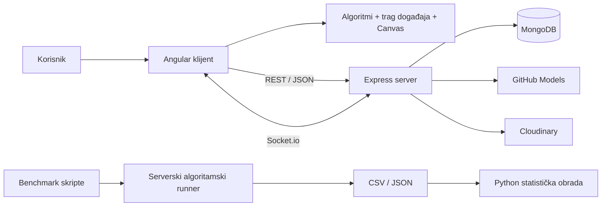

# Priprema za odbranu master rada

## Kako da koristiš ovaj dokument

Ne pokušavaj da naučiš sve napamet. Za odbranu su potrebna tri nivoa znanja:

1. **Crvena nit** — problem, rešenje, tri doprinosa i pet glavnih rezultata. Ovo moraš moći da kažeš bez razmišljanja.
2. **Obrazloženje odluka** — zašto baš ova arhitektura, algoritmi, metrike i AI pristup.
3. **Granice rada** — šta nije urađeno, šta rezultati ne dokazuju i kako bi se sistem dalje unapredio.

Za svaku brojku u ovom dokumentu važi jedno pravilo: prvo reci **šta znači**, pa tek onda broj.

---

# 1. Crvena nit rada

## Jedna rečenica

Razvijena je interaktivna full-stack aplikacija koja osam algoritama za pronalaženje puta prikazuje kroz isti model događaja, omogućava njihovo ponovljivo poređenje i koristi jezičke modele samo za objašnjenje programski proverenih rezultata.

## Odgovor od 20 sekundi

> Problem postojećih vizualizatora je što uglavnom lepo prikazuju algoritam, ali ne povezuju vizualizaciju, kontrolisano poređenje, aktivno rešavanje zadataka i proverljivu AI pomoć. Moj rad objedinjuje ta četiri aspekta. Glavni doprinosi su realizovan sistem, infrastruktura za ponovljiva merenja i eksperimentalna analiza algoritama, bodovanja i jezičkih modela.

## Odgovor od 60 sekundi

> Napravio sam klijentsko-serversku aplikaciju za učenje i poređenje algoritama za pronalaženje puta. Podržano je osam algoritama, sedam generatora mapa i tri glavna režima: vizualizacija korak po korak, paralelno poređenje i Playground u kome korisnik sam konstruiše put. Svi algoritmi koriste isti interfejs i emituju standardizovane događaje, pa prikaz ne zavisi od konkretnog algoritma. Drugi deo rada je ponovljiva evaluacija: 9.444 algoritamske simulacije i 11.250 simulacija bodovnog sistema. Na primer, A* je dao istu cenu puta kao Dijkstra uz 62,5% manje proširenih čvorova, dok je Swarm dodatno smanjio broj proširenja uz malu prosečnu suboptimalnost. Treći deo je AI sloj. Program računa metrike i bira ključne trenutke, a jezički model ih objašnjava. Time je smanjen rizik od haluciniranih numeričkih tvrdnji.

## Tri doprinosa koja treba stalno vraćati u odgovor

1. **Softverski doprinos:** funkcionalna aplikacija sa osam algoritama, tri režima rada, sedam generatora, nalozima, čuvanjem mapa i AI podrškom.
2. **Metodološki doprinos:** zajednička skala cene, mera suboptimalnosti, deterministički generatori i ista merna infrastruktura za sve algoritme.
3. **Eksperimentalni doprinos:** 9.444 algoritamske simulacije, 11.250 simulacija bodovanja i 430 AI pokušaja, sa statističkom obradom rezultata.

## Šta rad ne tvrdi

- Ne tvrdi da je jedan algoritam najbolji u svim situacijama.
- Ne tvrdi da AI sam računa ili garantuje ispravnost rezultata.
- Ne tvrdi da je dokazan pozitivan uticaj aplikacije na ishode učenja.
- Ne tvrdi da je sprovedeno korisničko testiranje sa studentima.
- Ne tvrdi da je sistem produkciono završen ili javno postavljen.

---

# 2. Od početne ideje do konačnog sistema

## Početna namera

Početna ideja je već sadržala jezgro konačnog rada:

- interaktivnu mrežu sa startom, ciljem, zidovima i težinama;
- vizualizaciju algoritma korak po korak;
- poređenje algoritama;
- Playground sa bodovanjem;
- čuvanje mapa, istorije i rezultata;
- AI objašnjenja, preporuke i generisanje scenarija;
- algoritamsku, AI, UX i korisničku evaluaciju;
- full-stack arhitekturu i javno postavljanje aplikacije.

Ideja je, međutim, bila šira od onoga što je bilo razumno kvalitetno realizovati i evaluirati u jednom master radu.

## Planirano, realizovano i odloženo

| Oblast | Početni plan | Konačno stanje | Razlog ili posledica |
|---|---|---|---|
| Algoritmi | BFS, DFS, Dijkstra, A*, Greedy, Swarm porodica, bidirekcione i dinamičke varijante | Osam algoritama: BFS, DFS, Dijkstra, A*, Greedy, Swarm, Convergent Swarm i 0-1 BFS | Izabrana je širina dovoljna za poređenje različitih strategija, bez slabo motivisanih varijanti |
| Bidirectional Swarm | Planiran | Nije realizovan | Složenost nije opravdavala dodatni akademski doprinos |
| D* Lite / LPA* | Razmatrani za dinamičko planiranje | Nisu realizovani | Fokus je prebačen na opštu vizualizaciju i evaluaciju osam algoritama |
| Post-edit Re-solve | Ponovno rešavanje posle izmene mape | Realizovano | Korisnik menja završenu mapu i ponovo pokreće izabrani postupak |
| Simulate Live | Kretanje agenta uz promenu mape tokom izvršavanja | Nije pronađen u finalnoj implementaciji | Ostaje prirodan pravac razvoja |
| Puni chatbot / NL editor | Slobodna konverzacija i uređivanje mape jezikom | Zamenjeni kontekstualnom pomoći i generatorom | Smanjeni su preklapanje funkcija i rizik nepredvidive izmene stanja |
| AI Generator | Model direktno vraća kompletnu mrežu | Model izdvaja nameru, program generiše i meri kandidate | Pouzdanije, jeftinije i proverljivo; direktno generisanje mreže nije bilo dovoljno stabilno |
| Generatori mapa | Nekoliko osnovnih tipova | Sedam tipova | Eksperimentalni deo je proširen |
| Korisničko testiranje | Planirano | Instrument pripremljen, testiranje nije sprovedeno | Ne sme se tvrditi da je izmerena upotrebljivost ili efekat na učenje |
| Hosting i domen | Planirani | Nisu potvrđeni finalnim repozitorijumom | Sistem je vrednovan kao lokalna istraživačka aplikacija |

## Najbolji način da objasniš promenu obima

> Početna specifikacija je namerno bila šira. Tokom rada sam izbacio funkcije čiji trošak implementacije nije donosio srazmeran istraživački doprinos, kao što su Bidirectional Swarm i specijalizovani dinamički algoritmi. Istovremeno sam produbio merljivi deo rada: uvedeni su zajednička skala cene, suboptimalnost, više kontrolisanih kategorija eksperimenata i odvojena evaluacija AI modula. Dakle, obim funkcija je sužen, ali su proverljivost i eksperimentalna dubina povećane.

## Šta je najvažniji zaokret u radu

Najvažniji zaokret nije promena tehnologije, već promena AI Generatora:

1. Korisnik zada zahtev prirodnim jezikom.
2. Model ne crta proizvoljno svaku ćeliju.
3. Model iz zahteva izvlači strukturiranu nameru.
4. Program generiše više determinističkih kandidata.
5. Klasični algoritmi mere kandidate.
6. Sistem bira kandidata koji najbolje zadovoljava zahtev.

To je konkretan primer principa **„program računa, model objašnjava ili strukturira nameru”**.

## Kako se rad razlikuje od postojećih rešenja

| Rešenje | Glavna vrednost | Ograničenje relevantno za ovaj rad |
|---|---|---|
| Mihailescu Pathfinding Visualizer | jasan mrežni prikaz osam algoritama | nema server, trajne podatke, istovremeno poređenje, metrike ni izvoz |
| PathFinding.js | biblioteka sa 11 postupaka i dobrim opcijama susedstva | namenjena je programerima i igrama, a ne učenju; nema ponderisan teren |
| VisuAlgo | široka nastavna platforma sa automatskim zadacima | najkraći putevi su prikazani na apstraktnom grafu, bez pune mrežne analize A* porodice |
| Ovaj rad | mreža, ponderi, Compare, Playground, merenje, izvoz, trajni podaci i AI pomoć | uži skup algoritama od biblioteka i bez sprovedene korisničke studije |

Praznina nije tvrdnja da prethodni alati nemaju vrednost. Ona je presek tri potrebe koje nijedan analizirani alat ne pokriva zajedno:

1. **merenje**, da se vizuelni utisak proveri brojkom;
2. **poređenje**, da više postupaka dobije isti ulaz;
3. **aktivno učešće**, da korisnik konstruiše rešenje umesto da samo gleda.

---

# 3. Problem kao graf — najmanji primer koji treba da znaš

## Zašto dužina puta nije isto što i cena

Pretpostavimo dve putanje do cilja:

| Put | Težine ćelija u koje se ulazi | Broj poteza | Ukupna cena |
|---|---:|---:|---:|
| A | 1, 5, 1 | 3 | $1+5+1=7$ |
| B | 1, 1, 1, 1 | 4 | $1+1+1+1=4$ |

BFS bira put A ako prvi stiže do cilja u tri poteza. Dijkstra bira put B jer minimizuje cenu. Zato se u radu odvojeno mere:

- **dužina puta** — broj prelaza;
- **cena puta** — zbir cena prelaza.

## Kako se mreža prevodi u graf

- Svaka prolazna ćelija je čvor.
- Dozvoljeno pomeranje između susednih ćelija je grana.
- Zid uklanja mogućnost prolaza.
- Težina odredišne ćelije određuje cenu ulaska.
- Start je početni, a cilj završni čvor.

Za ortogonalni potez u ćeliju težine $w$ cena je $w$. Za dijagonalni potez cena je $w\sqrt{2}$.

## Četiri i osam suseda

- **4-povezano susedstvo:** gore, dole, levo, desno.
- **8-povezano susedstvo:** dodate su četiri dijagonale.

Osam suseda obično skraćuje put, ali povećava faktor grananja. U klijentskoj vizualizaciji dijagonalno „sečenje ugla” između dva zida je blokirano. U benchmark implementaciji ta provera nije ista, što je metodološko ograničenje pri direktnom prenošenju rezultata na klijentsko ponašanje.

## Heuristike na jednom primeru

Neka je horizontalna razlika $d_x=2$, a vertikalna $d_y=3$.

| Heuristika | Račun | Vrednost | Prirodna primena |
|---|---:|---:|---|
| Manhattan | $d_x+d_y$ | $5$ | 4-povezano kretanje |
| Euklidska | $\sqrt{d_x^2+d_y^2}$ | $\sqrt{13}\approx3,61$ | prava linija |
| Čebiševljeva | $\max(d_x,d_y)$ | $3$ | dijagonala iste cene kao ortogonala |
| Oktilna | $\max(d_x,d_y)+(\sqrt2-1)\min(d_x,d_y)$ | $3,83$ | 8-povezano kretanje sa dijagonalom $\sqrt2$ |

Heuristika je **dopustiva** ako nikada ne preceni stvarnu preostalu cenu. A* garantuje optimalnost uz odgovarajuću dopustivu, odnosno u uobičajenoj grafovskoj varijanti konzistentnu heuristiku i nenegativne cene.

Važna nijansa: Manhattan je prirodan i dopustiv za 4-povezano kretanje. Ako se bez prilagođavanja koristi uz dijagonale cene $\sqrt2$, može preceniti cenu, jer za jednu dijagonalu daje $2$, a stvarni trošak je $1,414$.

---

# 4. Osam algoritama bez ulaska u kod

## Jedna tabela za pamćenje

| Algoritam | Kako bira sledeći čvor | Optimalnost | Glavna uloga u radu |
|---|---|---|---|
| BFS | najranije dodat čvor, FIFO | da, samo za jednake cene grana | osnovna neinformisana pretraga |
| DFS | poslednje dodat čvor, LIFO | ne | pokazuje posledice dubokog istraživanja |
| Dijkstra | najmanji $g$ | da, za nenegativne cene | referentna optimalna ponderisana pretraga |
| A* | najmanji $g+h$ | da, uz odgovarajuću heuristiku | optimalnost uz usmeravanje ka cilju |
| Greedy | najmanji $h$ | ne | mala pretraga, veći rizik lošeg puta |
| Swarm | najmanji $g+2h$ | ne garantuje optimalnost | umeren kompromis |
| Convergent Swarm | najmanji $g+5h$ | ne garantuje optimalnost | agresivniji kompromis |
| 0-1 BFS | grana 0 ide napred, grana 1 nazad u deque | da, samo za cene 0 i 1 | specijalizovan linearan postupak |

Ovde je $g$ cena od starta, a $h$ procena preostale cene do cilja.

## Kako ista dva čvora vide različiti algoritmi

Neka čvor A ima $g=4$, $h=3$, a čvor B ima $g=6$, $h=1$.

| Postupak | A | B | Prvi izbor |
|---|---:|---:|---|
| Dijkstra | $4$ | $6$ | A |
| A* | $4+3=7$ | $6+1=7$ | zavisi od razrešenja izjednačenja |
| Greedy | $3$ | $1$ | B |
| Swarm, $w=2$ | $4+2\cdot3=10$ | $6+2\cdot1=8$ | B |
| Convergent, $w=5$ | $4+5\cdot3=19$ | $6+5\cdot1=11$ | B |

Kako raste težina heuristike, pretraga snažnije ide ka cilju i manje istražuje okolinu, ali lakše zanemari jeftiniji obilazak.

Dijkstra, A*, Greedy i obe Swarm varijante dele istu best-first mašinu; razlikuje ih upravo funkcija prioriteta iz tabele. Time se ista ispravka frontijera ili relaksacije primenjuje na svih pet postupaka, a poređenje manje zavisi od slučajnih implementacionih razlika.

## BFS

**Suština:** obrađuje čvorove po nivoima udaljenosti u broju grana.

Ako postoje put od 3 koraka cene 7 i put od 4 koraka cene 4, BFS bira prvi. Zato je optimalan za neponderisane grafove, ali ne i za opštu ponderisanu mrežu.

**Složenost:** $O(V+E)$ vreme i $O(V)$ memorija u najgorem slučaju.

**Rezultat rada:** u zbirnoj kategoriji E1 prosečna suboptimalnost je 18,11%. Na čistom generatoru ponderisanog terena ona je 68,99%. Nemoj pomešati te dve brojke.

## DFS

**Suština:** ide jednom granom što dublje, pa se vraća kada više nema nastavka.

Brzo može naići na cilj, ali redosled suseda može da ga odvede u veoma dug obilazak. Ne garantuje ni najkraći ni najjeftiniji put.

**Složenost:** $O(V+E)$ vreme i $O(V)$ memorija u grafovskoj implementaciji.

**Rezultat rada:** prosečna suboptimalnost je 378,15%, a prosečan maksimalni frontijer 145,49, naspram 29,33 kod BFS-a.

Ako komisija kaže da se DFS obično smatra memorijski štedljivijim, odgovor je:

> Teorijska najgora granica oba postupka u grafovskoj implementaciji je $O(V)$. Česta intuicija o maloj memoriji DFS-a odnosi se na stablo i dubinu aktivne putanje. Ovde je merena stvarna najveća veličina frontijera uz konkretan redosled suseda i skup posećenih čvorova. Na ovim mrežama DFS je akumulirao više neobrađenih alternativa, dok je BFS imao relativno uzak talas pretrage. To je empirijski rezultat ove implementacije i skupa mapa, a ne nova univerzalna teorema o DFS-u.

## Dijkstra

**Suština:** uvek potvrđuje još nepotvrđen čvor sa najmanjom poznatom cenom $g$.

Za nenegativne cene prvi konačno potvrđen najjeftiniji put do cilja je optimalan.

**Složenost sa binarnim hipom:** približno $O((V+E)\log V)$, uz $O(V)$ memorije.

**Uloga u radu:** referentni algoritam za optimalnu cenu i osnov za računanje suboptimalnosti drugih algoritama.

## A*

**Suština:** kombinuje već plaćenu cenu i procenu ostatka, $f=g+h$.

Dijkstra sa $h=0$ postaje poseban slučaj A*. Dobra heuristika ne menja cilj optimizacije, već redosled istraživanja.

**Rezultat rada:** A* i Dijkstra imaju istu prosečnu cenu 66,48 u E1, ali A* proširuje 218,74 čvora naspram 584,11. Smanjenje je:

$$
\frac{584,11-218,74}{584,11}\cdot100\%=62,5\%.
$$

To je najvažniji algoritamski rezultat rada.

## Greedy Best-First

**Suština:** gleda samo procenjenu blizinu cilja, $f=h$.

Zato često brzo stigne u blizinu cilja, ali ne vidi da je do tog mesta već potrošio veliku cenu ili da ga ispred čeka prepreka.

**Rezultat rada:** najmanje prosečno proširenja među glavnim postupcima, 95,11, ali 23,89% prosečne suboptimalnosti.

## Swarm i Convergent Swarm

U ovom radu „Swarm” nije algoritam roja čestica. To je naziv za dve ponderisane A* varijante:

$$
f(n)=g(n)+w\,h(n).
$$

- Swarm koristi $w=2$.
- Convergent Swarm koristi $w=5$.

Veće $w$ znači manje istraživanja i veće oslanjanje na pravac ka cilju.

**Rezultat za Swarm:** 123,50 proširenja, odnosno 43,5% manje od A*, uz 2,97% prosečne suboptimalnosti.

**Rezultat za Convergent Swarm:** 101,07 proširenja uz 15,51% suboptimalnosti. Dodatna ušteda je mala u odnosu na rast greške.

Eksperiment sa $w$ jasno pokazuje kompromis:

| $w$ | Proširenja | Suboptimalnost |
|---:|---:|---:|
| 1 | 252,48 | 0,00% |
| 1,5 | 189,91 | 1,40% |
| 2 | 172,09 | 2,39% |
| 3 | 160,39 | 9,40% |
| 5 | 151,11 | 23,66% |
| 10 | 147,13 | 27,06% |

Posle $w=3$ dobija se malo dodatnog smanjenja pretrage, a mnogo veća suboptimalnost.

## 0-1 BFS

**Suština:** koristi dvostrani red. Prelaz cene 0 dodaje se na početak, a prelaz cene 1 na kraj.

Primer: iz starta se može u A cenom 1 i u B cenom 0. B se stavlja ispred A, pa se obrađuje prvi. Time deque održava isti efekat kao prioritetni red, ali samo zato što postoje dve dozvoljene cene.

**Složenost u svom domenu:** $O(V+E)$.

**Granica primene:** čim postoje opšte težine ili dijagonalne cene $\sqrt2$, pretpostavka više ne važi. U E1 je izmerena prosečna suboptimalnost 128,51%, a na čistom ponderisanom generatoru 182,01%. To nije dokaz da je algoritam loš, već da je primenjen van svog domena.

---

# 5. Arhitektura sistema

## Slika koju treba da umeš usmeno da nacrtaš

## Tri sloja

### 1. Klijentski sloj

- Angular upravlja stranicama, stanjem i korisničkim interakcijama.
- Algoritmi na klijentu proizvode trag za animaciju.
- HTML5 Canvas prikazuje velike mreže bez hiljada DOM elemenata.
- RxJS servisi dele reaktivno stanje između komponenti.

### 2. Serverski sloj

- Express izlaže API za autentikaciju, mape, pokretanja, Playground, upload, AI i benchmark.
- Server validira zahteve, kontroliše pristup i komunicira sa spoljnim servisima.
- Posebne ne-vizuelne implementacije algoritama koriste se za masovna merenja, proveru AI zahteva i Playground.

### 3. Sloj podataka

- MongoDB čuva korisnike, mape, rezultate pokretanja i Playground pokušaje.
- CSV i JSON čuvaju sirove eksperimentalne rezultate.
- Python skripta iz sirovih podataka proizvodi tabele, intervale poverenja i grafikone.

## Zašto algoritmi postoje i na klijentu i na serveru

To nije slučajna duplikacija, već dve različite potrebe:

| Klijent | Server |
|---|---|
| proizvodi detaljne događaje za svaki korak | računa rezultat bez troška animacije |
| omogućava trenutnu interakciju i premotavanje | omogućava hiljade ponovljivih eksperimenata |
| prilagođen vizualizaciji | prilagođen benchmarku, AI proveri i bodovanju |

Rizik takvog pristupa je razilaženje implementacija. Primer je različit tretman dijagonalnog sečenja ugla. Dugoročno rešenje bilo bi zajedničko jezgro ili zajednički paket sa pravilima susedstva i cene.

## Zajednički interfejs algoritama

Svaki algoritam konceptualno podržava pet operacija:

1. inicijalizacija mrežom, startom, ciljem i opcijama;
2. izvršavanje jednog logičkog koraka;
3. provera da li je završen;
4. preuzimanje konačnog rezultata;
5. preuzimanje celog traga.

Korak ne crta direktno na ekranu. On emituje događaje, na primer „čvor dodat u frontijer”, „čvor obrađen” ili „deo konačnog puta”. Renderer zna kako se događaj prikazuje, ali ne mora da zna koji ga je algoritam proizveo.

Ovo razdvajanje omogućava:

- isti Canvas za svih osam algoritama;
- Play, Pause, Step i skok na proizvoljan korak;
- Compare bez posebnog prikaza za svaki algoritam;
- izdvajanje ključnih trenutaka za AI Tutor;
- dodavanje novog algoritma bez izmene osnovnog renderer-a.

## Zašto se trag unapred izračunava

Vizualizacija najpre izvrši algoritam i sačuva događaje, a zatim ih reprodukuje željenom brzinom. Korisnik zato može trenutno da pauzira, premota ili skoči na kraj bez vraćanja unutrašnjeg stanja algoritma unazad.

Cena tog izbora je memorija proporcionalna dužini traga. Za veoma velike mreže bolji pristup bi bili periodični snimci stanja i delimična rekonstrukcija.

## Tok četiri tipična zahteva

### Vizualizacija

Korisnik menja mrežu → klijentski algoritam pravi trag → servis reprodukuje događaje → Canvas ih prikazuje → metrike se ažuriraju.

### Čuvanje mape

Klijent šalje strukturiranu mapu sa JWT tokenom → server proverava korisnika i zahtev → MongoDB čuva dokument → mapa se kasnije ponovo učitava.

### AI objašnjenje

Program izračuna rezultate i sažme kontekst → server dodaje kontrolisan prompt → GitHub Models vraća strukturiran JSON → Zod proverava oblik → klijent prikazuje objašnjenje.

### Benchmark

Serverski runner generiše mapu iz seed-a → svi algoritmi dobijaju isti ulaz → rezultat se meri zajedničkim funkcijama → upisuje se jedan CSV red po simulaciji → Python radi statistiku.

---

# 6. Tehnologije i obrazloženje izbora

## Finalno proverene verzije

| Deo | Tehnologija |
|---|---|
| Klijent | Angular 21.2, TypeScript 5.9, RxJS 7.8 |
| Stilovi | Tailwind CSS 4.2 i SCSS/CSS |
| Prikaz mreže | HTML5 Canvas |
| Server | Node.js, Express 5.2, TypeScript 6.0 |
| Baza | MongoDB i Mongoose 9.4 |
| Real-time | Socket.io 4.8 |
| Validacija | Zod 4.3 |
| Autentikacija | JWT i bcryptjs |
| Zaštita | Helmet i ograničavanje broja zahteva |
| AI | GitHub Models API |
| Slike profila | Cloudinary |
| Analiza | Python, pandas, NumPy, SciPy i Matplotlib |

Raniji dokument o frontend evaluaciji navodi Angular 19. To je zastarela pomoćna dokumentacija; finalni paket i rad koriste Angular 21.2.

## Zašto Angular

- prirodno razdvaja stranice, komponente i servise;
- TypeScript daje proverljive ugovore za složene strukture mreže i događaja;
- RxJS odgovara stanju koje se menja tokom animacije, autentikacije i Socket.io obaveštenja;
- standalone komponente smanjuju potrebu za modulima.

## Zašto Canvas, a ne DOM mreža

Mreža 100 × 200 ima 20.000 ćelija. Kada bi svaka bila poseban DOM element, preglednik bi morao da održava i stilizuje 20.000 čvorova. Canvas koristi jednu površinu i eksplicitno crtanje, što je pogodnije za često menjanje velikog broja ćelija.

Nedostatak je što pristupačnost i događaji po ćeliji moraju ručno da se rešavaju.

## Zašto Express

- tanak HTTP sloj bez nametnute arhitekture;
- jednostavna integracija sa Mongoose, JWT, Socket.io i AI servisom;
- isti jezik na klijentu i serveru smanjuje kontekstualni trošak razvoja.

## Zašto MongoDB

Mapa je prirodno dokument: dimenzije, start, cilj, lista zidova, težine i metapodaci. MongoDB dobro odgovara takvoj ugnježdenoj strukturi i omogućava da se mapa učita kao celina.

Relacijska baza bi takođe bila moguća. Izbor MongoDB-a je praktičan, a ne tvrdnja da relacioni model ne može da reši problem.

## Zašto Socket.io

Socket.io nije potreban za samu vizualizaciju. Koristi se za trenutno obaveštenje o promeni leaderboard-a, gde server treba da pošalje događaj povezanim klijentima bez njihovog periodičnog proveravanja.

## Bezbednosne odluke

- lozinke se ne čuvaju otvoreno, već kao bcrypt hash;
- JWT identifikuje korisnika na zaštićenim rutama;
- token se gasi na klijentu posle 15 minuta neaktivnosti;
- Helmet postavlja zaštitna HTTP zaglavlja;
- AI rute imaju ograničenje broja zahteva;
- server, a ne klijent, čuva pristupne podatke za spoljne servise;
- upload slika ima ograničenje veličine i ide preko kontrolisane rute.

Za produkciju bi i dalje trebalo koristiti HTTPS, strožu konfiguraciju CORS-a, rotaciju tajni, osvežavajuće tokene i potpuno serversko preračunavanje Playground rezultata.

---

# 7. Funkcionalne celine

## Visualize

- izbor jednog algoritma;
- crtanje zidova i težina;
- izbor heuristike, susedstva i Swarm težine kada su primenljivi;
- Play, Pause, Step, brzina i skok na korak;
- prikaz frontijera, obrađenih čvorova, trenutnog čvora i puta;
- izvoz rezultata;
- Post-edit Re-solve posle promene završene mape.

## Compare

- više algoritama dobija istu mapu;
- koriste se iste postavke i zajedničke metrike;
- korisnik vizuelno i brojčano poredi teritoriju pretrage, cenu i broj proširenja;
- AI može da objasni već izračunato poređenje.

## Playground

- korisnik ručno konstruiše put;
- sistem proverava validnost, cenu i odstupanje od referentnog rezultata;
- prikazuje ukupan skor i komponente skora;
- pokušaj se čuva i utiče na leaderboard.

## Nalozi i trajni podaci

- registracija i prijava;
- profil i profilna slika;
- privatne i javne mape;
- istorija pokretanja i pokušaja;
- korisnička statistika.

## Interaktivna pomoć

Finalna aplikacija ima 18 koraka vodiča raspoređenih kroz glavne režime. Raniji frontend izveštaj sa 17 koraka je zastareo.

## Sedam generatora mapa

1. otvoreno polje;
2. slučajne prepreke;
3. lavirint rekurzivnom podelom;
4. ponderisani teren;
5. mešovita mapa;
6. usko grlo;
7. gradski blokovi.

Generator nije samo pogodnost interfejsa. On je deo metodologije, jer omogućava kontrolisane porodice problema sa ponovljivim seed-om.

---

# 8. Metodologija evaluacije

## Zašto broj proširenih čvorova ima prednost nad vremenom

Primer: dva pokretanja istog algoritma obrade tačno 500 čvorova, ali jedno traje 0,20 ms, a drugo 0,31 ms zbog JIT kompajliranja, rada operativnog sistema ili preciznosti tajmera. Broj 500 opisuje algoritamski rad stabilnije od razlike od 0,11 ms.

Zato su glavne mere:

- broj proširenih čvorova;
- prava cena vraćenog puta;
- suboptimalnost;
- najveća veličina frontijera;
- udeo pronađenih puteva;
- vreme kao dopunska empirijska mera.

## Definicije metrika

### Prošireni čvorovi

Broj čvorova koji su uzeti iz frontijera i obrađeni. To je mera količine pretrage, a ne isto što i broj svih otkrivenih čvorova.

### Maksimalni frontijer

Najveći broj čvorova koji su istovremeno čekali obradu. Koristi se kao praktična aproksimacija memorijskog otiska same pretrage; ne meri kompletan JavaScript heap procesa.

### Prava cena puta

Ponovo se računa iz vraćene putanje zajedničkom funkcijom:

$$
C(P)=\sum_{i=1}^{k} w(v_i)\cdot
\begin{cases}
1, & \text{ortogonalni potez},\\
\sqrt2, & \text{dijagonalni potez}.
\end{cases}
$$

Važno je da se ne veruje internoj „ceni” algoritma. Svaki vraćeni put prolazi kroz isti spoljni merač.

### Suboptimalnost

$$
\sigma=\frac{C-C_{\mathrm{opt}}}{C_{\mathrm{opt}}}\cdot100\%.
$$

Ako je optimalna cena 40, a algoritam vrati cenu 50:

$$
\sigma=\frac{50-40}{40}\cdot100\%=25\%.
$$

Nula znači optimalan put. Vrednost 25% znači da je put četvrtinu skuplji od optimalnog, a ne da je „25 procentnih poena lošiji”.

### Vreme

Za vreme se koristi medijana, jer pojedinačni ekstremni zastoji mogu snažno pomeriti aritmetičku sredinu. Za broj proširenja prikazuju se sredina i Studentov 95% interval poverenja.

### Udeo pronađenih puteva

Procenat mapa na kojima postoji i pronađen je put. U E1 je za sve algoritme isti, 83,03%, jer svi implementirani postupci mogu da pronađu put ako postoji; razlika je u radu i kvalitetu vraćenog puta.

## Pošteno poređenje

Da bi poređenje bilo smisleno:

1. svi algoritmi dobijaju istu generisanu mapu;
2. seed omogućava rekonstrukciju te mape;
3. meri se ista definicija proširenja;
4. prava cena se računa spolja, istom funkcijom;
5. Dijkstra obezbeđuje referentnu optimalnu cenu;
6. sirovi rezultati se čuvaju pre statističke obrade;
7. Python skripta automatski proizvodi finalne tabele i grafikone.

## Konstrukcija skupa od 9.444 simulacije

| Kategorija | Svrha | Broj redova |
|---|---|---:|
| E1 | osnovno poređenje algoritama po tipovima mapa i gustini | 2.640 |
| E6 | skalabilnost prema veličini mreže | 2.160 |
| E7 | uticaj izbora heuristike | 1.800 |
| E8 | 4-povezano naspram 8-povezanog susedstva | 1.440 |
| E9 | uticaj težinskog parametra $w$ | 972 |
| E10 | ponašanje na nerešivim mapama sa zapečaćenim startom | 432 |
| **Ukupno** |  | **9.444** |

E1 ima 330 scenarija po algoritmu i osam algoritama:

$$
330\cdot8=2.640.
$$

Tih 330 čine:

- 30 otvorenih mapa;
- 90 mapa sa slučajnim preprekama;
- 90 mešovitih mapa;
- po 30 ponderisanih, lavirintskih, uskih i gradskih mapa.

Slučajne i mešovite mape imaju po tri gustine prepreka, zato ih ima tri puta više.

Ostale kategorije se dobijaju ovako:

- E6: $5$ veličina × $3$ generatora × $18$ seed-ova × $8$ algoritama = $2.160$;
- E7: $5\cdot18=90$ mapa i $4\cdot4+4=20$ konfiguracija, pa $90\cdot20=1.800$;
- E8: $5$ generatora × $18$ seed-ova × $2$ režima susedstva × $8$ algoritama = $1.440$;
- E9: $3\cdot18=54$ mape i $2\cdot7+4=18$ konfiguracija, pa $54\cdot18=972$.

E10 koristi tri veličine mreže, 18 determinističkih seed-ova i svih osam algoritama:

$$
3\cdot18\cdot8=432.
$$

Start je potpuno zapečaćen, pa se proverava da svaki postupak korektno završi sa ishodom „nema puta”.

## Uslovi merenja

- AMD Ryzen 9 7900;
- 64 GB radne memorije;
- Windows 11;
- Node.js 24.12;
- jedan proces i jedna nit;
- bez drugog aktivnog opterećenja;
- brojač vremena visoke rezolucije;
- pre svake kategorije po 30 odbačenih warm-up pokretanja svakog algoritma.

Warm-up je uveden zato što je JIT činio prva pokretanja višestruko sporijim. Posle zagrevanja najveće zabeleženo vreme Dijkstre na standardnoj mreži palo je sa 5,46 na 0,49 ms. Zato se u odbrani ne poredi hladan start jednog algoritma sa zagrejanim radom drugog.

## Ponovljivost

Ponovljivost ne znači da će izmereno vreme biti bit-po-bit isto na svakom računaru. Znači da isti seed i konfiguracija daju istu mapu, isti put i iste strukturne metrike, dok vreme ostaje zavisno od okruženja.

Implementirani generator slučajnih brojeva je deterministička Mulberry32-stilska funkcija. U tekstu rada se na jednom mestu opisuje kao LCG; to je dokumentaciona nedoslednost koju treba iskreno priznati ako bude primećena. Ona ne menja princip ponovljivosti, ali bi opis trebalo uskladiti sa implementacijom.

## Statistička obrada

- aritmetička sredina za proširenja, cenu i frontijer;
- standardna devijacija kao mera rasipanja;
- Studentov $t$ interval za 95% interval poverenja sredine;
- medijana za vreme;
- Pearsonova i Spearmanova korelacija proširenja i vremena;
- log-log regresija za empirijski eksponent rasta.

Spearmanov koeficijent $\rho=0,974$ pokazuje veoma snažnu monotonu vezu između broja proširenja i vremena. Ne dokazuje da je broj proširenja jedini uzrok vremena; struktura podataka, implementacija i okruženje takođe utiču.

## Granice statističkog zaključka

- **9.444 su simulacije, ne 9.444 nezavisne mape.** Ista mapa se namerno ponavlja za više algoritama i konfiguracija da bi poređenje bilo kontrolisano.
- Prikazani 95% intervali opisuju neizvesnost sredine pojedinačnog algoritma. Pošto algoritmi rade nad istim mapama, direktan inferencijalni test njihove razlike trebalo bi da koristi uparene razlike ili upareni bootstrap.
- U radu nisu prijavljeni testovi statističke značajnosti između svakog para algoritama. Zato koristi izraz „izmerena razlika”, a ne „statistički značajna razlika”.
- Suboptimalnost se računa samo kada je put pronađen i referentna cena je pozitivna. E10 zato proverava ispravan neuspeh, ali ne ulazi u prosek cene.
- Maksimalni frontijer je aproksimacija memorije algoritamske strukture, ne ukupna memorija procesa.
- Generisane mape pokrivaju sedam kontrolisanih porodica, ali ne sve realne probleme. Standardna Moving AI zbirka olakšala bi poređenje sa drugim radovima, ali ne sadrži ponderisan teren koji je ovde centralan.

---

# 9. Algoritamski rezultati koje treba razumeti

## Glavna zbirna tabela E1

| Algoritam | Proširenja | Cena | Suboptimalnost | Maks. frontijer | Medijana vremena |
|---|---:|---:|---:|---:|---:|
| BFS | 583,11 | 74,58 | 18,11% | 29,33 | 0,18 ms |
| DFS | 276,45 | 235,09 | 378,15% | 145,49 | 0,06 ms |
| Dijkstra | 584,11 | 66,48 | 0,00% | 41,79 | 0,26 ms |
| A* | 218,74 | 66,48 | 0,00% | 51,38 | 0,07 ms |
| Greedy | 95,11 | 77,89 | 23,89% | 37,68 | 0,02 ms |
| Swarm | 123,50 | 67,76 | 2,97% | 39,50 | 0,03 ms |
| Convergent Swarm | 101,07 | 73,16 | 15,51% | 37,15 | 0,02 ms |
| 0-1 BFS | 310,54 | 122,03 | 128,51% | 115,38 | 0,09 ms |

## Pet zaključaka važnijih od cele tabele

### 1. A* je najbolji izbor kada je optimalnost obavezna, a heuristika odgovara kretanju

Ista cena kao Dijkstra, uz 62,5% manje proširenja u E1.

### 2. Swarm je dobar praktičan kompromis u ovom skupu eksperimenata

U odnosu na A* ima 43,5% manje proširenja, a prosečno plaća 2,97% skuplji put.

### 3. Greedy je najagresivniji „brz” izbor, ali rizik nije zanemarljiv

Proširuje samo 95,11 čvorova, ali je put prosečno 23,89% skuplji od optimuma.

### 4. Domen algoritma je važniji od etikete „brz”

0-1 BFS je linearan i optimalan u svom domenu, ali je van domena dao 128,51% prosečne suboptimalnosti.

### 5. Teorijska intuicija mora da se proveri na konkretnoj implementaciji

DFS je u ovom eksperimentu imao skoro pet puta veći maksimalni frontijer od BFS-a:

$$
\frac{145,49}{29,33}\approx4,96.
$$

## Rezultati po tipu mape

- Na otvorenom polju skoro svi usmereni algoritmi odmah prate pravac do cilja: 25 proširenja, dok BFS i Dijkstra šire veliki talas.
- Na lavirintu postoji malo stvarnih izbora, pa svi vraćaju isti koridor i razlike se smanjuju.
- Na ponderisanom terenu BFS, DFS i Greedy biraju kratku, ali skupu putanju: 68,99% suboptimalnosti.
- Na gradskim blokovima Swarm ima samo 0,60% suboptimalnosti, jer struktura mape dobro odgovara usmeravanju ka cilju.
- Na mešovitim mapama Greedy raste na 58,87% suboptimalnosti, što pokazuje rizik lokalno privlačnog, ali skupog pravca.

## Gustina prepreka

| Gustina | Udeo mapa sa putem |
|---:|---:|
| 15% | 100,00% |
| 30% | 93,33% |
| 45% | 16,67% |

Na 45% prepreka broj proširenja može pasti zato što većina mapa brzo postane nerešiva. Manje proširenja tada ne znači bolji algoritam, već drugačiji skup rešivih problema.

## Skalabilnost

Na mreži od 20.000 ćelija prosečna proširenja su približno:

- Dijkstra: 9.865;
- BFS: 9.875;
- DFS: 3.545;
- A*: 2.930;
- Swarm: 2.357;
- Greedy: 1.659.

Empirijski eksponent broja proširenja u odnosu na broj ćelija je blizu 1 za većinu algoritama u posmatranom opsegu. To je empirijski fit, ne zamena za teorijsku analizu složenosti.

## Uticaj heuristike

U 4-povezanom susedstvu A* je imao:

| Heuristika | Proširenja | Suboptimalnost |
|---|---:|---:|
| Manhattan | 224,19 | 0% |
| Euklidska | 295,33 | 0% |
| Oktilna | 273,63 | 0% |
| Čebiševljeva | 320,42 | 0% |

Manhattan je ovde najinformisanija dopustiva heuristika prilagođena ortogonalnom kretanju. Zato obrađuje najmanje čvorova, a ne gubi optimalnost.

## Uticaj osam suseda

Za A* prelazak sa četiri na osam suseda smanjio je:

- prosečnu dužinu puta sa 77,41 na 55,54;
- broj proširenja sa 224,19 na 149,70.

Cena je pala sa 77,22 na 62,65. Dijkstra je u istom 8-povezanom skupu imao 62,59, pa se ne sme reći da je A* u svakoj testiranoj konfiguraciji bio savršeno optimalan. Garancija zavisi od usklađenosti heuristike i modela kretanja.

---

# 10. AI sloj

## Zašto AI uopšte postoji

Klasični algoritam može pouzdano da kaže da je A* proširio 120, a Dijkstra 400 čvorova. Ne mora dobro da objasni početniku **zašto** se to desilo na konkretnoj mapi. Jezički model je korišćen za verbalizaciju konteksta, a ne kao zamena za pretragu.

## Četiri korisnički vidljiva modula

### AI Tutor

Program iz traga bira ključne trenutke, na primer nagli rast frontijera ili pronalazak cilja. Model dobija te proverene trenutke i objašnjava ih.

### AI Generator

Model strukturira nameru korisnika. Program generiše kandidate, pokreće algoritme i meri da li kandidat zaista ispunjava zahtev.

### AI Recommender

Model dobija karakteristike mape i stvarno izmerene rezultate algoritama, pa objašnjava koji je izbor najbolji ili najgori prema zadatom kriterijumu.

### Kontekstualna pomoć

Korisnik bira element ili metriku, a model dobija uzak kontekst potreban za objašnjenje tog elementa.

## Šest zaštitnih odluka

1. AI ključ je samo na serveru.
2. Klijent ne poziva model direktno.
3. Prompt sadrži programski izračunate brojeve.
4. Odgovor mora da prati strukturiran JSON format.
5. Zod proverava strukturu pre slanja klijentu.
6. Postoje timeout od 60 sekundi, rate limit i fallback za kvotu ili nedostupan model.

Strukturna validacija ne dokazuje da je svaka rečenica semantički tačna, ali uklanja veliki deo nepredvidivih formata i omogućava kontrolisan prikaz.

## Šta je tačno evaluirano

Sirovi skup sadrži 430 pokušaja:

- 410 uspešnih poziva kroz pet uspešno korišćenih modela ili varijanti;
- 20 neuspelih pokušaja jednog modela;
- tri modela imaju potpuno pokretanje;
- dva imaju delimično pokretanje zbog praktičnih ograničenja.

Zbog nejednakog broja pokušaja poređenje svih modela nije potpuno balansirano. Zbirne tačnosti računaju se nad uspešnim pokretanjima.

Posebno su mereni Recommender, Generator i Tutor. Kontekstualna pomoć nije imala jednostavan automatski tačan ishod i zato nije uključena u ovu kvantitativnu evaluaciju. Servis/model endpoint korišćen tokom merenja kasnije je povučen, pa potpuno isto AI merenje zahteva drugi izvor istih ili uporedivih modela.

## Recommender: stroga i tolerantna tačnost

Zamisli da A* i Swarm oba prošire po 100 čvorova. U sirovom zapisu je A* označen kao „najbolji”, a model izabere Swarm.

- Stroga mera kaže: netačno.
- Tolerantna mera kaže: tačno, jer je izabrana stvarna minimalna vrednost.

Zbirni rezultati uspešnih modela:

| Zadatak | Strogo | Tolerantno |
|---|---:|---:|
| izbor najboljeg | 59,52% | 72,62% |
| izbor najgoreg | 23,02% | 53,17% |

Najgori algoritam je teže odrediti zbog više izjednačenja i slabijeg praćenja svih vrednosti u promptu.

Rezultati po modelu nisu jednaki. Mistral-small-2503 je u potpunom pokretanju imao 90% stroge tačnosti za najbolji algoritam, dok je Meta-Llama-3.1-8B imao 35,71%. To pokazuje da strukturiran izlaz sam po sebi ne garantuje dobro zaključivanje.

## Generator

- 50 testova;
- 100% validan JSON;
- 100% uspešno izdvojena namera;
- 66% konačnih mapa ispunilo je zahtev prema programskoj proveri.

Razlika između 100% i 66% je važna: zahtev može uspešno proći test strukturirane ekstrakcije, a ograničeni broj generisanih kandidata ipak ne mora sadržati mapu koja zadovoljava traženi odnos algoritama. Validan oblik namere nije dokaz potpunog semantičkog razumevanja.

## Tutor

- 108 testova;
- 99,07% strukturno validnih odgovora, odnosno 107 od 108;
- 99,07% zapisa imalo je validne momente;
- prosečno su vraćena 3,0 momenta po odgovoru.

To meri robusnost formata i pokrivenost zadatog konteksta. Ne meri da li student posle objašnjenja bolje razume algoritam.

## Latencija

| Modul | Medijana | P90 |
|---|---:|---:|
| Preporuka | 1,42 s | 3,13 s |
| Generator | 1,46 s | 2,70 s |
| Tutor | 2,59 s | 7,37 s |

Tutor je sporiji jer zahteva duži ulaz i bogatije objašnjenje.

## Najpošteniji zaključak o AI delu

> Evaluacija podržava arhitektonsku odluku da se numerička istina zadrži u determinističkom programu, a da se model koristi za strukturiranje namere i jezičko objašnjenje. Ne podržava tvrdnju da model pouzdano samostalno bira algoritam niti da dokazano poboljšava učenje.

---

# 11. Playground i bodovanje

## Formula

$$
S=\max\left(0,\min\left(110,100-P_c-P_n+B_b+B_p\right)\right).
$$

Gde su:

- $P_c$ — penal za skuplji put, najviše 50;
- $P_n$ — penal za nevalidne poteze, po 10, najviše 50;
- $B_b$ — bonus za brzinu, najviše 10;
- $B_p$ — bonus za poklapanje sa optimalnom cenom, 10;
- rezultat je ograničen na interval od 0 do 110.

## Konkretan primer

Optimalna cena je 20, korisnikov put košta 25, ima jedan nevalidan potez i predat je dovoljno brzo za bonus 10.

$$
P_c=\frac{25-20}{20}\cdot100=25,
$$

pa bez bonusa za poklapanje:

$$
S=100-25-10+10=75.
$$

Maksimum je 110, a ne 100, da bi se odvojio odličan rezultat sa oba bonusa od običnog završavanja zadatka.

Slučaj „nema puta” ima posebnu granu. Tačna prijava dobija $100+B_b$, do najviše 110, a pogrešna prijava na rešivoj mapi dobija 0. U simulaciji je tačna prijava imala bonus 8 i zato skor 108.

## Konstrukcija 11.250 simulacija

| Simulirani igrač | Broj |
|---|---:|
| savršen | 2.250 |
| dobar | 2.250 |
| slab | 2.250 |
| sa nevalidnim potezima | 2.250 |
| tačno prijavljuje da nema puta | 750 |
| pogrešno prijavljuje da nema puta | 750 |
| predaje put na nerešivoj mapi | 750 |
| **Ukupno** | **11.250** |

## Rezultati

| Tip | Prosečan skor | Medijana |
|---|---:|---:|
| savršen | 106,62 | 110 |
| dobar | 98,49 | 101 |
| slab | 60,35 | 50 |
| nevalidni potezi | 95,61 | 100 |
| tačno „nema puta” | 108 | 108 |
| pogrešno „nema puta” | 0 | 0 |
| put na nerešivoj mapi | 0 | 0 |

Bodovanje jasno odvaja dobar i slab put i pravilno rešava slučaj bez puta. Međutim, simulirani „nevalidni” igrač ima visok prosek jer pravi samo jedan mali teleport, odnosno uglavnom samo penal od 10. Zato rezultat ne dokazuje da su sve vrste varanja snažno razdvojene.

„Savršeni” igrač nema uvek 110 zato što simulacija kod BFS-a na ponderisanoj mapi prati put optimalan po broju koraka, dok se penal poredi sa optimalnom ponderisanom cenom. To je koristan nalaz o definiciji referentnog rezultata, ne greška aritmetike.

## Produkciono ograničenje

Serverska ruta ograničava vrednosti komponenti koje dobija od klijenta, ali ih ne rekonstruiše sve nezavisno iz sirovog puta. Za istraživački prototip to omogućava čuvanje rezultata, ali produkcioni leaderboard bi morao serverski da ponovi validaciju putanje i kompletno bodovanje kako klijent ne bi bio izvor istine.

---

# 12. UX evaluacija i njene granice

## Šta je urađeno

Interfejs je analiziran prema:

- Nielsenovim heuristikama;
- Tognazzinijevim principima;
- Shneidermanovim pravilima;
- Normanovim principima.

Provereni su vidljivost stanja, konzistentnost, kontrola korisnika, prevencija grešaka, povratna informacija, prepoznavanje umesto prisećanja i pomoć.

## Uočene slabosti

- nema potpunog undo/redo steka;
- ručno stanje mreže nije automatski sačuvano;
- neke mrežne greške imaju generičke poruke;
- nema izvedenog Simulate Live režima;
- pristupačnost Canvas-a zahteva dalje unapređenje;
- bodovanje bi u produkciji trebalo u potpunosti preračunati na serveru.

## Šta nije urađeno

Nisu sprovedene sesije sa stvarnim korisnicima. Zato numeričke heurističke ocene ne treba predstavljati kao objektivnu meru upotrebljivosti.

Heurističku evaluaciju je sproveo autor. Literatura preporučuje tri do pet nezavisnih ocenjivača, dok jedan ocenjivač tipično otkriva samo deo problema. Zato je rezultat sistematska samoprocena, a ne nezavisna potvrda kvaliteta interfejsa.

Pripremljen je kompletan instrument:

- šest praktičnih zadataka;
- beleženje vremena, uspeha i potrebne pomoći;
- think-aloud zapažanja;
- standardni SUS upitnik;
- tri otvorena završna pitanja.

## Odgovor na pitanje „Zašto nema korisničkog testiranja?”

> To je glavno ograničenje evaluacije. U okviru rada sam dao prednost realizaciji ponovljive algoritamske i AI infrastrukture i pripremio kompletan instrument za korisničku studiju, ali studija nije sprovedena. Zbog toga ne tvrdim da je dokazan efekat na učenje. Sledeći korak bi bio pre/post eksperiment sa studentima, kontrolnom grupom i SUS upitnikom, uz merenje uspeha na zadacima.

---

# 13. Brojevi koje vredi naučiti napamet

Ne uči celu tabelu. Nauči sledeća sidra:

1. **8 algoritama**, **7 generatora**, **3 glavna režima**, **4 AI modula**.
2. **9.444** algoritamske simulacije.
3. **11.250** simulacija bodovnog sistema.
4. **430** AI pokušaja, od čega **410 uspešnih**.
5. A*: **218,74** naspram Dijkstre **584,11** proširenja, ista cena **66,48**.
6. A* smanjuje proširenja za **62,5%** u odnosu na Dijkstru.
7. Swarm: **123,50** proširenja i **2,97%** suboptimalnosti.
8. Swarm smanjuje proširenja za **43,5%** u odnosu na A*.
9. BFS: **18,11%** zbirne suboptimalnosti; na čistom ponderisanom generatoru **68,99%**.
10. 0-1 BFS van domena: **128,51%** zbirne suboptimalnosti.
11. DFS/BFS frontijer: **145,49 / 29,33**, približno pet puta.
12. Korelacija proširenja i vremena: Spearman $\rho=0,974$.
13. AI najbolji algoritam: **59,52% strogo**, **72,62% tolerantno**.
14. AI najgori algoritam: **23,02% strogo**, **53,17% tolerantno**.
15. Generator: **100% namera**, **66% ispunjen zahtev**.
16. Tutor: **107/108** strukturno validnih odgovora.

## Rezervne brojke za potpitanja

- Greedy: 95,11 proširenja, 23,89% suboptimalnosti.
- Convergent Swarm: 101,07 proširenja, 15,51% suboptimalnosti.
- Rešivost pri 15/30/45% prepreka: 100 / 93,33 / 16,67%.
- Na 20.000 ćelija: Dijkstra 9.865, A* 2.930, Greedy 1.659 proširenja.
- Playground: savršen 106,62; dobar 98,49; slab 60,35.

---

# 14. Najverovatnija pitanja komisije

## 1. Šta je originalni doprinos rada?

**Kratko:**

> Originalnost nije u izmišljanju novog algoritma, već u jedinstvenom sistemu koji povezuje zajednički događajni model osam algoritama, ponovljivu eksperimentalnu infrastrukturu, aktivno rešavanje zadataka i proverljivu AI pomoć.

**Ako traže više:**

> Posebno bih izdvojio zajedničku spoljnu meru cene, kontrolisano poređenje na istim seed-ovima i arhitekturu u kojoj program računa, a model objašnjava. To omogućava da obrazovni interfejs i istraživačka evaluacija koriste iste osnovne rezultate.

## 2. Zašto je potreban još jedan vizualizator?

> Postojeća rešenja obično dobro pokrivaju jednu osu: animaciju, biblioteku algoritama ili zadatke. Ovaj rad povezuje vizualizaciju, Compare, Playground, trajne podatke, izvoz merenja i AI objašnjenja. Dodatna vrednost je što zaključci nisu zasnovani samo na demonstraciji, već na sačuvanom i ponovljivom eksperimentu.

## 3. Zašto je ovo full-stack, ako algoritam može da radi u pregledaču?

> Sama animacija zaista može da radi u pregledaču. Server je potreban za naloge, trajno čuvanje mapa i pokretanja, leaderboard, bezbedan AI proxy, upload i masovne benchmarke. Klijent i server zato imaju različite odgovornosti.

## 4. Koji algoritam je najbolji?

> Bez kriterijuma pitanje nema jedinstven odgovor. Ako je potrebna optimalnost na ponderisanoj mreži i postoji dobra heuristika, A* je najbolji rezultat ovog eksperimenta. Ako je prihvatljiv mali gubitak kvaliteta, Swarm je dao bolji kompromis. Ako su cene samo 0 i 1, 0-1 BFS ima posebnu prednost.

## 5. Zašto je A* efikasniji od Dijkstre?

> Dijkstra rangira samo po dosadašnjoj ceni $g$ i širi se u svim jeftinim pravcima. A* dodaje procenu $h$ do cilja. Na primer, dva čvora sa istim $g=10$, ali $h=2$ i $h=20$, za Dijkstru su jednaka, dok A* prvo bira prvi. U E1 je zato A* imao istu cenu puta uz 62,5% manje proširenja.

## 6. Kada A* gubi optimalnost?

> Kada heuristika precenjuje ili nije usklađena sa modelom kretanja, ili kada se naruše pretpostavke o cenama i načinu ponovnog otvaranja čvorova. Konkretan primer je Manhattan uz dijagonalni potez cene $\sqrt2$: procena 2 precenjuje stvarnu cenu 1,414.

## 7. Zašto BFS nije optimalan na ponderisanoj mapi?

> BFS minimizuje broj grana. Put od tri poteza cena 1, 5 i 1 košta 7, dok put od četiri jedinična poteza košta 4. BFS bira prvi, Dijkstra drugi.

## 8. Zašto ste uključili 0-1 BFS ako mape imaju i druge težine?

> Upravo da se pokaže značaj domena primene. U svom domenu 0-1 BFS je optimalan u linearnom vremenu. Van domena je dao 128,51% zbirne suboptimalnosti. To je edukativno jači rezultat od prikazivanja algoritma samo u idealnim uslovima.

## 9. Šta su Swarm algoritmi u ovom radu?

> To su ponderisane A* varijante, $g+w h$, a ne populacioni algoritmi roja. Swarm koristi $w=2$, a Convergent Swarm $w=5$. Naziv je zadržan iz porodice vizualizacionih algoritama, ali matematička osnova je Weighted A*.

## 10. Zašto je $w=2$ razuman izbor?

> Eksperiment pokazuje koleno kompromisa. Pri $w=2$ suboptimalnost je 2,39% u namenskom eksperimentu, uz veliko smanjenje proširenja. Posle $w=3$ proširenja padaju malo, a suboptimalnost naglo raste, do 23,66% pri $w=5$.

## 11. Kako znate da je poređenje algoritama pošteno?

> Svi dobijaju istu mapu i konfiguraciju, mape se rekonstruišu iz seed-a, proširenje ima zajedničku definiciju, a cena se ponovo računa iz vraćenog puta istom funkcijom. Dijkstra daje referentnu optimalnu cenu, a sirovi redovi ostaju sačuvani pre analize.

## 12. Odakle tačno 9.444 simulacije?

> To je zbir šest kategorija: 2.640 osnovnih, 2.160 za skalabilnost, 1.800 za heuristike, 1.440 za susedstvo, 972 za parametar $w$ i 432 za namerno nerešive mape.

## 13. Zašto koristite proširene čvorove, a ne samo vreme?

> Vreme na milisekundskom nivou zavisi od JIT-a, operativnog sistema i tajmera. Broj proširenih čvorova stabilnije opisuje količinu algoritamskog rada. Vreme je ipak zadržano kao dopunska mera, a jaka korelacija $\rho=0,974$ potvrđuje da se dve mere uglavnom kreću zajedno.

## 14. Da li 95% interval znači da je 95% rezultata unutar njega?

> Ne. To je interval za procenjenu srednju vrednost, ne interval pojedinačnih rezultata. U ponovljenom uzorkovanju, približno 95% tako konstruisanih intervala sadržalo bi stvarnu sredinu pod pretpostavkama postupka.

## 15. Zašto AI kada program već zna rezultat?

> Program zna broj i može da proveri tačnost, ali ne daje nužno prilagođeno jezičko objašnjenje konkretnog traga. AI je sloj za tumačenje i strukturiranje namere. Njegova uloga je ograničena baš zato što je slabiji u pouzdanom računanju.

## 16. Kako sprečavate halucinacije?

> Ne mogu se potpuno sprečiti, ali se površina rizika smanjuje. Model dobija programski proverene brojke, odgovor je strukturiran i validiran, zahtevi su uski, a program zadržava autoritet nad rezultatom. Model ne generiše konačnu metriku koju sistem prihvata kao istinu.

## 17. Zašto je AI tačnost samo 59,52%?

> To je stroga mera na zadatku sa čestim izjednačenjima. Tolerantna mera raste na 72,62%, jer prihvata svaki algoritam sa stvarnom minimalnom vrednošću. Ipak, rezultat nije dovoljno visok za autonomno odlučivanje i upravo opravdava arhitekturu u kojoj AI samo savetuje i objašnjava.

## 18. Zašto je izbor najgoreg algoritma još slabiji?

> Najgora vrednost je češće izjednačena, a modeli slabije prate sve brojeve u dužem promptu. Stroga tačnost je 23,02%, tolerantna 53,17%. To je jasno ograničenje, ne rezultat koji treba ulepšavati.

## 19. Zašto Generator ima 100% razumevanje, a samo 66% uspeha?

> To su dva odvojena koraka. Model je uspešno preveo tekst u strukturirane uslove, ali konačan uspeh zavisi od toga da li se među ograničenim brojem determinističkih kandidata pojavi mapa koja te uslove zaista ispunjava.

## 20. Šta biste prvo poboljšali u AI delu?

> Povećao bih i adaptivno usmeravao broj kandidata Generatora, uveo uravnotežen broj testova po modelu i ljudsku ocenu kvaliteta objašnjenja. Za Recommender bih prvo programski odredio skup izjednačenih najboljih i od modela tražio samo obrazloženje tog skupa.

## 21. Zašto nema korisničkog testiranja?

> Zbog ograničenog obima prioritet je dat implementaciji i ponovljivoj tehničkoj evaluaciji. Instrument sa šest zadataka, think-aloud postupkom i SUS upitnikom je pripremljen, ali nije primenjen. Zato rad ne dokazuje obrazovni efekat.

## 22. Da li heuristička UX evaluacija dokazuje da je interfejs dobar?

> Ne u potpunosti. Ona sistematski otkriva probleme prema poznatim principima, ali bez nezavisnih evaluatora i stvarnih korisnika ostaje stručna analiza autora. Potrebna je korisnička studija za tvrdnje o upotrebljivosti i učenju.

## 23. Kako radi Playground skor veći od 100?

> Osnova je 100, a dva bonusa mogu da dodaju do 20, posle čega se rezultat ograničava na 110. Tako se maksimalno tačan i brz pokušaj razlikuje od samo korektnog pokušaja.

## 24. Može li korisnik da prevari leaderboard?

> U istraživačkom prototipu postoji serversko ograničavanje komponenti, ali ne i potpuno nezavisno preračunavanje svega iz sirove putanje. Za produkciju bih server učinio jedinim autoritetom za validaciju i skor. To je poznato ograničenje trenutnog sistema.

## 25. Zašto je DFS imao veći frontijer od BFS-a?

> Merena je konkretna maksimalna veličina strukture čekanja, ne apstraktna dubina rekurzije. Uz dati redosled suseda DFS je ostavljao mnogo alternativa na steku, dok je BFS talas na ovim mapama ostao uži. Oba imaju $O(V)$ memoriju u najgorem slučaju.

## 26. Da li korelacija 0,974 dokazuje uzročnost?

> Ne. Pokazuje snažnu monotonu vezu: više proširenja uglavnom prati duže vreme. Ne izdvaja proširenja kao jedini uzrok i ne uklanja uticaj strukture podataka, JIT-a ili hardvera.

## 27. Zašto algoritmi postoje dvaput?

> Klijentske verzije moraju da emituju detaljan trag za animaciju, a serverske moraju brzo da izvrše hiljade merenja bez prikaza. To je svesna podela optimizovana za dve uloge. Rizik razilaženja bih ubuduće smanjio zajedničkim paketom za pravila i testove usaglašenosti.

## 28. Koja je najveća tehnička slabost arhitekture?

> Duplirana algoritamska pravila mogu da se raziđu. Konkretno, klijent i benchmark nemaju potpuno isti tretman dijagonalnog sečenja ugla. To ne ruši poređenja unutar jednog benchmarka, jer svi tamo dobijaju ista pravila, ali ograničava direktno poistovećivanje benchmarka sa svakim detaljem UI izvršavanja.

## 29. Kako biste dokazali obrazovni efekat?

> Studentima bih dao pre-test, zatim nasumično dodelio rad sa aplikacijom ili standardnim materijalom, pa sproveo post-test i odloženi test. Merio bih tačnost objašnjenja, transfer na novu mapu, vreme zadatka i SUS, uz dovoljno ispitanika i unapred definisane hipoteze.

## 30. Šta je prvi sledeći korak razvoja?

> Prvo korisnička studija, jer zatvara najveću dokaznu prazninu. Tehnički bih zatim izdvojio zajedničko algoritamsko jezgro, uveo potpuno serversko bodovanje i realizovao pravi live replanning, verovatno sa D* Lite ili LPA* kao kontrolom naspram ponovnog pokretanja A*.

## 31. Zašto je izabrano baš ovih osam algoritama?

> Skup pravi kontrolisani spektar: BFS i DFS su neinformisane pretrage, Dijkstra uvodi cenu, A* heuristiku, Greedy ekstremno oslanjanje na heuristiku, dve Weighted A* varijante kompromis, a 0-1 BFS specijalizovan domen. Cilj nije najveći broj algoritama, već poređenje različitih principa odlučivanja.

## 32. Po čemu se rad razlikuje od Mihailescu vizualizatora, PathFinding.js i VisuAlgo?

> Mihailescu daje dobru animaciju, PathFinding.js dobru programersku biblioteku, a VisuAlgo široku nastavnu platformu. Ovaj rad je usmeren na presek mrežnog ponderisanog problema, istog-ulaza za više algoritama, izvozivih metrika i aktivnog Playground zadatka, uz AI koji dobija proverene rezultate.

## 33. Da li imate 9.444 nezavisna uzorka?

> Ne. To su 9.444 simulaciona reda. Ista mapa se namerno koristi za više algoritama, pa su njihovi rezultati upareni. Broj pokazuje obim izvršavanja, a ne broj nezavisno uzorkovanih mapa.

## 34. Da li preklapanje 95% intervala dokazuje da nema razlike?

> Ne, kao što ni nepreklapanje samo po sebi nije zamena za unapred izabran test. Intervali u radu opisuju sredine pojedinačnih algoritama. Za formalno poređenje koristio bih interval uparenih razlika ili upareni bootstrap nad istim mapama.

## 35. Da li maksimalni frontijer meri memorijsku složenost?

> Meri praktičan vrh glavne strukture čekanja i zato je koristan proxy. Ne uključuje sve objekte, skup posećenih čvorova, roditelje, runtime overhead ni trag vizualizacije. Teorijska granica i ukupna procesna memorija moraju se navesti odvojeno.

## 36. Zašto nije korišćen standardni skup mapa?

> Standardna zbirka bi olakšala poređenje sa drugim radovima, ali korišćena Moving AI zbirka ne pokriva ponderisan teren, koji je centralan za razliku BFS-a, Dijkstre i A*. Generatori daju kontrolu nad gustinom, težinama i seed-om; najbolje buduće rešenje je koristiti oba skupa.

---

# 15. Pitanja o nedoslednostima — odgovori bez defanzive

## Angular 19 ili 21?

> Finalni package fajl koristi Angular 21.2. Broj 19 je ostao u ranijem pomoćnom frontend izveštaju i predstavlja zastarelu dokumentaciju.

## 17 ili 18 koraka vodiča?

> Finalna aplikacija ima 18. Raniji evaluacioni dokument je napravljen pre poslednje izmene.

## LCG ili Mulberry32?

> Implementacija koristi Mulberry32-stilski deterministički generator. Naziv LCG u tekstualnom opisu je dokumentaciona greška. Ključna eksperimentalna osobina, determinističko preslikavanje seed-a u mapu, ostaje očuvana.

## Da li je Simulate Live realizovan?

> Ne u finalnom kodu. Realizovan je Post-edit Re-solve, dok je pravi live režim ostao planirani pravac razvoja.

## Da li A* uvek daje istu cenu kao Dijkstra?

> U glavnoj E1 konfiguraciji daje. Ne treba generalizovati na svaku kombinaciju heuristike i susedstva. U 8-povezanom eksperimentu prosečne cene su 62,65 za A* i 62,59 za Dijkstru, što pokazuje važnost usklađene heuristike.

## Da li je BFS suboptimalnost 18,11% ili 68,99%?

> Obe brojke su tačne za različite preseke. 18,11% je prosek kroz rešive E1 scenarije, a 68,99% je rezultat samo na generatoru ponderisanog terena.

---

# 16. Predlog prezentacije od 10–15 minuta

## Slajd 1 — Problem i cilj, 45 sekundi

- Vizualizatori često prikazuju, ali ne mere i ne proveravaju AI objašnjenja.
- Cilj: jedan sistem za vizualizaciju, poređenje, praksu i ponovljivu evaluaciju.

**Rečenica prelaza:** „Rešenje sam organizovao oko zajedničkog algoritamskog traga.”

## Slajd 2 — Doprinosi i konačni obim, 60 sekundi

- osam algoritama;
- sedam generatora;
- tri režima;
- četiri AI modula;
- tri doprinosa rada.

Ne troši vreme na kompletnu istoriju obima; samo reci da je širina sužena, a evaluacija produbljena.

## Slajd 3 — Arhitektura, 75 sekundi

- Angular + Canvas;
- Express + MongoDB;
- GitHub Models preko servera;
- događaji odvajaju algoritam od prikaza;
- klijent za trag, server za masovna merenja.

## Slajd 4 — Algoritamska ideja, 75 sekundi

Prikaži samo porodicu prioriteta:

$$
\text{Dijkstra}:g,\quad A^*:g+h,\quad Greedy:h,\quad Swarm:g+wh.
$$

Koristi primer A: $(g,h)=(4,3)$ i B: $(6,1)$.

## Slajd 5 — Tri režima, 60 sekundi

Jedan kadar ili kratka demonstracija:

- Visualize: trag korak po korak;
- Compare: ista mapa, više algoritama;
- Playground: korisnik pravi put i dobija objašnjiv skor.

## Slajd 6 — Metodologija, 90 sekundi

- 9.444 simulacije;
- isti seed i ulaz;
- spoljno računata prava cena;
- suboptimalnost;
- proširenja kao primarna, vreme kao dopunska mera.

Obavezno pokaži numerički primer: optimalno 40, vraćeno 50 → 25%.

## Slajd 7 — Glavni algoritamski rezultati, 120 sekundi

Prikaži najviše četiri podatka:

- A*: 62,5% manje proširenja od Dijkstre, ista cena;
- Swarm: još 43,5% manje od A*, 2,97% suboptimalnosti;
- BFS: 18,11% zbirne suboptimalnosti;
- 0-1 BFS: 128,51% van domena.

Zaključak slajda: izbor algoritma zavisi od kriterijuma i domena.

## Slajd 8 — AI, 90 sekundi

- „program računa, model objašnjava”;
- četiri modula;
- stroga naspram tolerantne tačnosti;
- Generator 100% namera, 66% zadovoljen zahtev;
- AI je pomoć, ne autoritet.

## Slajd 9 — Playground i UX, 60 sekundi

- 11.250 simulacija bodovanja;
- dobar 98,49, slab 60,35;
- heuristička evaluacija urađena;
- korisnička studija pripremljena, ali nije sprovedena.

## Slajd 10 — Zaključak i ograničenja, 60 sekundi

Ponovi tri doprinosa i navedi tri sledeća koraka:

1. korisnička studija;
2. zajedničko algoritamsko jezgro i potpuno serversko bodovanje;
3. pravi dinamički replanning.

## Ukupno

Ovaj raspored traje približno 11–12 minuta i ostavlja rezervu za sporiji govor ili kratku demonstraciju.

## Pravilo za demonstraciju

Ako demonstriraš uživo, pripremi jednu malu mapu i samo jedan tok od najviše 45 sekundi. Na slajdovima mora da postoji slika istog rezultata kao rezerva. Odbrana ne treba da zavisi od baze, AI kvote ili mreže.

---

# 17. Plan pripreme za naredna 2–3 dana

## Dan 1 — Razumevanje i slajdovi

### Blok 1, 90 minuta

- izgovori odgovor od 60 sekundi pet puta;
- nacrtaj arhitekturu iz glave;
- objasni numerički primer dužine i cene;
- objasni tabelu prioriteta $g$, $g+h$, $h$, $g+wh$.

### Blok 2, 120 minuta

- završi deset slajdova;
- na svakom ostavi jednu poruku, ne pasus;
- na rezultatskom slajdu zadrži samo četiri glavne brojke.

### Blok 3, 60 minuta

- odgovori naglas na pitanja 1–15;
- svaki prvi odgovor ograniči na 30 sekundi;
- tek zatim dodaj detalj za potpitanje.

## Dan 2 — Probe i teška pitanja

### Blok 1, 45 minuta

- održi prezentaciju sa tajmerom bez prekidanja;
- ciljaj 11–12 minuta;
- zapiši samo mesta na kojima si zastao.

### Blok 2, 90 minuta

- uvežbaj pitanja 16–30;
- posebno: AI tačnost, korisničko testiranje, DFS memorija, corner cutting i Playground autoritet.

### Blok 3, 45 minuta

- druga puna proba;
- snimi zvuk;
- izbaci svaku rečenicu koja ne doprinosi problemu, odluci, rezultatu ili ograničenju.

### Blok 4, 30 minuta

- proveri demo i rezervne slike;
- pripremi lokalnu aplikaciju bez oslanjanja na AI poziv;
- otvori finalni slajd i rezultate pre početka.

## Dan 3 ili poslednje jutro — Konsolidacija

- jedna mirna proba, bez menjanja strukture slajdova;
- ponovi 16 brojeva iz odeljka 13;
- ponovi šest odgovora o nedoslednostima;
- izgovori završnu rečenicu tri puta;
- prestani sa učenjem najmanje jedan sat pre odbrane.

## Završna rečenica

> Najvažniji rezultat nije da je jedan algoritam pobedio, već da isti sistem jasno pokazuje kada se garancija optimalnosti isplati, kada je razuman kompromis i zašto domen primene i proverljivost moraju ostati važniji od privlačnog, ali neproverenog odgovora.

---

# 18. Brza usmena proba

Odgovori bez gledanja, redom, u jednoj ili dve rečenice:

1. Koji problem rešava rad?
2. Koja su tri doprinosa?
3. Zašto cena nije isto što i dužina?
4. Koja je razlika između Dijkstre, A*, Greedy i Swarm prioriteta?
5. Pod kojim uslovom je A* optimalan?
6. Zašto je 0-1 BFS loš van svog domena?
7. Kako je obezbeđeno pošteno poređenje?
8. Odakle dolazi 9.444?
9. Zašto se meri broj proširenja?
10. Koji je glavni rezultat A*?
11. Koji je glavni rezultat Swarm-a?
12. Šta znači 2,97% suboptimalnosti?
13. Zašto AI ne računa metrike?
14. Šta je tolerantna AI tačnost?
15. Zašto Generator ima 100% i 66% u istom izveštaju?
16. Šta je glavno ograničenje UX evaluacije?
17. Kako bi unapredio Playground bezbednost?
18. Šta je planirano, a nije realizovano?
19. Koja nedoslednost postoji između klijenta i benchmarka?
20. Šta bi bio prvi sledeći eksperiment?

Ako na bilo koje pitanje ne možeš da odgovoriš za 30 sekundi, vrati se samo na odgovarajući odeljak. Nemoj ponovo čitati ceo dokument.

---

# 19. Mapa izvora istine u repozitorijumu

Kada proveravaš tvrdnju, koristi ovaj red prioriteta:

1. **Sirovi CSV/JSON i `Metrike/Analiza/analiza.py`** za brojke i formule.
2. **Finalni izvorni kod i package fajlovi** za realizovane funkcije i verzije.
3. **Poglavlja finalnog rada** za obrazloženje i narativ.
4. **Dokumenti iz `Teorija/`** za razvoj ideje i planirani obim.
5. **Pomoćni evaluacioni izveštaji** samo uz proveru, jer neki sadrže zastarele podatke.

Najvažniji konkretni izvori:

- `Teorija/0 - Inicijalna ideja projekta.docx` — početni i dopunjeni obim;
- `Pisanje master rada/Rad/04-arhitektura.md` — arhitektura;
- `Pisanje master rada/Rad/06-vestacka-inteligencija.md` — AI odluke;
- `Pisanje master rada/Rad/07-metodologija.md` — metrike i eksperimenti;
- `Pisanje master rada/Rad/08-rezultati-algoritmi.md` — algoritamski rezultati;
- `Pisanje master rada/Rad/09-evaluacija-ai-ux.md` — AI, Playground i UX;
- `Metrike/Analiza/tabele.md` — finalne izvedene tabele;
- `Metrike/Analiza/rezultati.json` — precizne numeričke vrednosti;
- `Metrike/Analiza/analiza.py` — način računanja svih agregata.